# Human Manual

## What This Pack Helps With

make mcp-memory-service safer to evaluate with memory-pipeline boundaries, consolidation checks, retrieval evals, and recovery paths for stale memory

## How To Use

1. Read `README.md`.
2. Load `AGENTS.md` or `CLAUDE.md`.
3. Run evals.
4. Use pitfall and risk files to recover from failure.

## What This Pack Does Not Do

- It does not replace upstream docs.
- It does not prove production readiness.
- It does not claim official endorsement.

## Doramagic Source Extract

# https://github.com/doobidoo/mcp-memory-service 项目说明书

生成时间：2026-05-12 06:04:02 UTC

## 目录

- [项目介绍](#introduction)
- [快速开始](#quick-start)
- [系统架构](#architecture)
- [存储后端](#storage-backends)
- [知识图谱](#knowledge-graph)
- [记忆整合系统](#consolidation)
- [质量评分系统](#quality-scoring)
- [MCP 协议集成](#mcp-integration)
- [代理框架集成](#agent-frameworks)
- [插件系统](#plugins)

<a id='introduction'></a>

## 项目介绍

### 相关页面

相关主题：[快速开始](#quick-start), [系统架构](#architecture)

<details>
<summary>相关源码文件</summary>

以下源码文件用于生成本页说明：

- [README.md](https://github.com/doobidoo/mcp-memory-service/blob/main/README.md)
- [src/mcp_memory_service/api/__init__.py](https://github.com/doobidoo/mcp-memory-service/blob/main/src/mcp_memory_service/api/__init__.py)
- [src/mcp_memory_service/web/app.py](https://github.com/doobidoo/mcp-memory-service/blob/main/src/mcp_memory_service/web/app.py)
- [src/mcp_memory_service/server_impl.py](https://github.com/doobidoo/mcp-memory-service/blob/main/src/mcp_memory_service/server_impl.py)
- [claude_commands/README.md](https://github.com/doobidoo/mcp-memory-service/blob/main/claude_commands/README.md)
- [claude-hooks/README.md](https://github.com/doobidoo/mcp-memory-service/blob/main/claude-hooks/README.md)
</details>

# 项目介绍

## 概述

MCP Memory Service 是一个基于 MCP（Model Context Protocol）架构的语义记忆存储与检索服务。该项目为 AI 应用提供持久化记忆能力，支持语义搜索、时间范围查询、标签分类等高级功能。 资料来源：[README.md:1-10]()

## 核心功能

### 记忆存储与管理

系统提供完整的记忆生命周期管理，包括存储、检索、删除和更新操作。每条记忆自动生成内容哈希和语义向量嵌入，便于精确匹配和相似性搜索。 资料来源：[src/mcp_memory_service/web/app.py:20-50]()

### 语义搜索能力

基于向量嵌入的语义相似度搜索是本项目的核心特性。用户可以使用自然语言查询，系统自动计算查询向量与存储记忆的余弦相似度，返回最相关的结果。 资料来源：[src/mcp_memory_service/api/__init__.py:10-25]()

### 实时事件流

通过 Server-Sent Events（SSE）技术，系统支持实时记忆事件推送。客户端可以订阅记忆创建、更新、删除等事件，实现与外部系统的实时集成。 资料来源：[src/mcp_memory_service/web/app.py:55-70]()

## 技术架构

### 系统组件

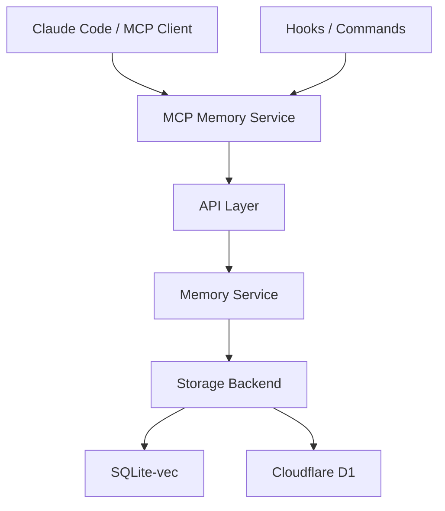

### 存储后端

系统支持多种存储后端配置：

| 后端类型 | 描述 | 适用场景 |
|---------|------|---------|
| SQLite-vec | 本地向量数据库，轻量级部署 | 个人用户、小型团队 |
| Cloudflare D1 + Vectorize | 云端向量存储，全球分发 | 企业级部署、高可用需求 |
| Hybrid | 混合模式，结合本地和云端优势 | 复杂架构场景 |

资料来源：[src/mcp_memory_service/web/app.py:120-135]()

### 嵌入模型

系统默认使用 **all-MiniLM-L6-v2** 嵌入模型，该模型在性能和精度之间取得良好平衡：

- 向量维度：384
- 上下文窗口：256 tokens
- 平均延迟：5-10ms（后续调用）

资料来源：[src/mcp_memory_service/web/app.py:140-145]()

## API 接口

### 记忆管理接口

| 接口 | 方法 | 路径 | 功能 |
|------|------|------|------|
| 存储记忆 | POST | `/api/memories` | 存储新记忆，自动生成嵌入向量 |
| 列出记忆 | GET | `/api/memories` | 分页列出所有记忆 |
| 获取记忆 | GET | `/api/memories/{hash}` | 通过内容哈希获取特定记忆 |
| 删除记忆 | DELETE | `/api/memories/{hash}` | 删除记忆及其嵌入向量 |

资料来源：[src/mcp_memory_service/web/app.py:15-45]()

### 搜索接口

| 接口 | 方法 | 路径 | 功能 |
|------|------|------|------|
| 语义搜索 | POST | `/api/search` | 基于嵌入向量的语义相似度搜索 |
| 相似记忆 | GET | `/api/search/similar/{hash}` | 查找与指定记忆相似的其他记忆 |

### 事件接口

| 接口 | 方法 | 路径 | 功能 |
|------|------|------|------|
| 事件流 | GET | `/api/events` | 订阅实时记忆事件流 |
| 统计信息 | GET | `/api/events/stats` | 查看 SSE 连接统计 |

## CLI 命令集成

系统提供一系列 Claude Code CLI 命令，方便在终端环境中操作记忆：

### 可用命令

| 命令 | 功能 |
|------|------|
| `/memory-store` | 存储新记忆 |
| `/memory-recall` | 基于时间表达式的记忆检索 |
| `/memory-search` | 标签和内容搜索 |
| `/memory-context` | 捕获当前会话上下文作为记忆 |
| `/memory-health` | 服务健康检查 |

资料来源：[claude_commands/README.md:15-50]()

### 安装方式

```bash
# 自动安装（推荐）
python scripts/installation/install.py

# 强制安装命令
python scripts/installation/install.py --install-claude-commands
```

## Claude Hooks 集成

系统提供自动化记忆管理钩子，深度集成到 Claude Code 工作流中：

### 钩子类型

| 钩子名称 | 触发时机 | 功能 |
|---------|---------|------|
| `session-start` | 会话开始时 | 自动加载相关项目记忆 |
| `mid-conversation` | 对话过程中 | 根据关键词触发记忆注入 |
| `session-end` | 会话结束时 | 存储会话洞察和决策 |
| `auto-capture` | 代码修改时 | 自动捕获代码变更上下文 |

资料来源：[claude-hooks/README.md:10-30]()

### 配置选项

```json
{
  "memoryService": {
    "endpoint": "https://your-server:8443",
    "apiKey": "your-api-key"
  },
  "verbosity": {
    "verbose": true,
    "showMemoryDetails": false,
    "cleanMode": false
  }
}
```

## 性能指标

### 响应时间

| 指标 | 数值 | 说明 |
|------|------|------|
| 首次调用 | ~50ms | 包含存储初始化开销 |
| 后续调用 | 5-10ms | 连接复用后延迟 |
| 内存占用 | <10MB | 服务进程内存开销 |

### 成本估算

- **费用**: $0.15/1M tokens
- **10用户部署年费**: $16.43/年

资料来源：[src/mcp_memory_service/api/__init__.py:5-15]()

## 维护工具

系统提供完整的维护脚本支持：

| 脚本 | 功能 |
|------|------|
| `check_memory_types.py` | 检查记忆类型碎片化程度 |
| `consolidate_memory_types.py` | 将碎片化类型合并为标准24类分类体系 |
| `cleanup_duplicates.py` | 识别和清理重复记忆 |

资料来源：[scripts/maintenance/README.md:10-40]()

## 插件系统

系统支持插件扩展机制，允许开发者自定义钩子处理逻辑：

```python
# 插件注册示例
def register(ctx):
    ctx.on("on_store", my_store_handler)
    ctx.on("on_retrieve", my_retrieve_handler)
```

插件通过 `entry_points` 机制自动加载：

```toml
[project.entry-points."mcp_memory_service.plugins"]
my_plugin = "my_package:register"
```

资料来源：[examples/plugin-audit-log/README.md:20-35]()

## 快速开始

### 安装依赖

```bash
pip install mcp-memory-service
```

### 启动服务

```bash
mcp-memory-http
```

### 验证安装

```bash
curl https://localhost:8443/api/health
```

### 基础使用示例

```python
from mcp_memory_service.api import search, store, health

# 存储记忆
hash_id = store("New memory", tags=["note", "important"])

# 语义搜索
results = search("architecture decisions", limit=5)
for m in results.memories:
    print(f"{m.hash}: {m.preview[:50]}...")

# 健康检查
info = health()
print(f"Backend: {info.backend}, Count: {info.count}")
```

资料来源：[src/mcp_memory_service/api/__init__.py:20-40]()

## 技术栈

| 组件 | 技术选型 |
|------|---------|
| 后端框架 | FastAPI / MCP Server |
| 向量数据库 | SQLite-vec |
| 嵌入模型 | all-MiniLM-L6-v2 |
| 实时通信 | Server-Sent Events |
| 部署方式 | Docker / Systemd / Litestream |

## 总结

MCP Memory Service 为 AI 应用提供了一个功能完整、高性能、可扩展的记忆存储解决方案。通过 MCP 协议与 Claude Code 的深度集成，以及丰富的 CLI 命令和 Hooks 机制，该服务能够无缝融入现有的 AI 开发工作流程，成为智能应用的"外部大脑"。

---

<a id='quick-start'></a>

## 快速开始

### 相关页面

相关主题：[项目介绍](#introduction)

<details>
<summary>相关源码文件</summary>

以下源码文件用于生成本页说明：

- [src/mcp_memory_service/web/app.py](https://github.com/doobidoo/mcp-memory-service/blob/main/src/mcp_memory_service/web/app.py) - Web 应用与 API 端点
- [src/mcp_memory_service/api/__init__.py](https://github.com/doobidoo/mcp-memory-service/blob/main/src/mcp_memory_service/api/__init__.py) - API 模块文档与使用示例
- [src/mcp_memory_service/server_impl.py](https://github.com/doobidoo/mcp-memory-service/blob/main/src/mcp_memory_service/server_impl.py) - MCP 服务器实现
- [claude-hooks/README.md](https://github.com/doobidoo/mcp-memory-service/blob/main/claude-hooks/README.md) - Claude Code 钩子安装指南
- [claude_commands/README.md](https://github.com/doobidoo/mcp-memory-service/blob/main/claude_commands/README.md) - Claude 命令文档
- [examples/plugin-audit-log/README.md](https://github.com/doobidoo/mcp-memory-service/blob/main/examples/plugin-audit-log/README.md) - 插件系统说明
</details>

# 快速开始

MCP Memory Service 是一个语义记忆服务，用于存储、检索和管理基于向量的语义记忆。本文档帮助你在 5 分钟内完成安装、配置并开始使用该服务。

## 系统要求

| 组件 | 最低版本 | 说明 |
|------|----------|------|
| Python | 3.10+ | 核心运行环境 |
| Node.js | 任意版本 | 用于钩子执行 |
| jq | 最新版本 | Claude Code 状态栏显示所需 |
| pip | 最新版本 | Python 包管理 |

资料来源：[claude-hooks/README.md:44-49]()

## 安装方式

### 方式一：完整安装（推荐）

完整安装包含 HTTP 服务器、Claude Code 钩子和命令：

```bash
cd mcp-memory-service
python scripts/installation/install.py
```

安装脚本会依次安装：

1. HTTP 服务器及其依赖
2. Claude Code 钩子（自动记忆加载和存储）
3. Claude Code 命令（手动记忆操作）
4. 交互式 API 文档

资料来源：[scripts/installation/install.py]() - 主安装脚本

### 方式二：分步安装

#### 步骤 1：安装 HTTP 服务器

```bash
pip install mcp-memory-service
mcp-memory-http  # 启动服务器
```

服务器默认在 `https://localhost:8443` 运行。

#### 步骤 2：安装 Claude Code 钩子

```bash
cd claude-hooks
python install_hooks.py  # 安装所有功能
```

或安装特定功能：

```bash
python install_hooks.py --basic             # 基础记忆钩子
python install_hooks.py --natural-triggers  # 自然记忆触发器
```

资料来源：[claude-hooks/README.md:38-51]()

#### 步骤 3：安装 Claude 命令

```bash
cd claude_commands
claude /install-commands
```

或使用安装脚本：

```bash
python scripts/installation/install.py --install-claude-commands
```

资料来源：[claude_commands/README.md:32-45]()

## 配置

### Claude Desktop 配置

在 Claude Desktop 配置文件中添加 MCP 服务器：

```json
{
  "mcpServers": {
    "memory": {
      "command": "uvx",
      "args": ["mcp-memory-service"],
      "env": {
        "MCP_MEMORY_DB_PATH": "~/.local/share/mcp-memory/sqlite_vec.db"
      }
    }
  }
}
```

资料来源：[examples/claude_desktop_config_template.json]() - Claude Desktop 配置模板

### 钩子配置

编辑 `~/.claude/hooks/config.json` 配置记忆服务连接：

```json
{
  "memoryService": {
    "endpoint": "https://your-server:8443",
    "apiKey": "your-api-key"
  },
  "verbosity": {
    "verbose": true,
    "showMemoryDetails": false,
    "cleanMode": false
  }
}
```

资料来源：[claude-hooks/README.md:66-75]()

## 服务启动

### 启动 HTTP 服务器

```bash
# 使用默认配置
mcp-memory-http

# 或使用自定义配置
mcp-memory-http --host 0.0.0.0 --port 8080
```

### 验证安装

```bash
# 检查服务健康状态
curl -k https://localhost:8443/api/health

# 验证钩子安装
claude --debug hooks
```

资料来源：[claude-hooks/README.md:53-56]()

## API 快速使用

### Python API

```python
from mcp_memory_service.api import search, store, health

# 搜索记忆（20 tokens）
results = search("架构决策", limit=5)
for m in results.memories:
    print(f"{m.hash}: {m.preview[:50]}...")

# 存储记忆（15 tokens）
hash_id = store("新记忆", tags=["笔记", "重要"])
print(f"已存储: {hash_id}")

# 健康检查（5 tokens）
info = health()
print(f"后端: {info.backend}, 数量: {info.count}")
```

资料来源：[src/mcp_memory_service/api/__init__.py:1-20]()

### REST API 端点

| 方法 | 端点 | 说明 |
|------|------|------|
| POST | `/api/memories` | 存储新记忆（自动生成嵌入向量） |
| GET | `/api/memories` | 列出所有记忆（支持分页） |
| GET | `/api/memories/{hash}` | 按内容哈希检索特定记忆 |
| DELETE | `/api/memories/{hash}` | 删除记忆及其嵌入向量 |
| POST | `/api/search` | 语义相似性搜索 |
| GET | `/api/search/similar/{hash}` | 查找相似记忆 |
| GET | `/api/events` | 订阅实时记忆事件流 |

资料来源：[src/mcp_memory_service/web/app.py:1-50]()

## Claude 命令速查

| 命令 | 用途 | 示例 |
|------|------|------|
| `/memory-recall` | 自然语言时间检索 | `/memory-recall "上周的数据库讨论"` |
| `/memory-search` | 标签和内容搜索 | `/memory-search --tags "架构,数据库"` |
| `/memory-context` | 上下文记忆保存 | `/memory-context --summary "架构规划"` |
| `/memory-health` | 服务健康检查 | `/memory-health --detailed` |

资料来源：[claude_commands/README.md:1-30]()

## 插件系统

### 安装插件

创建包含入口点的 Python 包：

```toml
[project.entry-points."mcp_memory_service.plugins"]
my_plugin = "my_package:register"
```

### 实现插件

```python
def register(ctx):
    ctx.on("on_store", my_store_handler)
    ctx.on("on_retrieve", my_retrieve_handler)
```

### 可用钩子

| 钩子 | 用途 |
|------|------|
| `on_store` | 记录哈希、类型、标签、内容长度 |
| `on_delete` | 记录删除的哈希 |
| `on_retrieve` | 记录查询和结果数量 |
| `on_consolidate` | 记录合并统计 |

资料来源：[examples/plugin-audit-log/README.md:1-40]()

## 性能指标

| 指标 | 数值 |
|------|------|
| 首次调用 | ~50ms（含存储初始化） |
| 后续调用 | ~5-10ms（连接复用） |
| 内存开销 | <10MB |
| 每百万 token 成本 | $0.15（10 用户部署约 $16.43/年） |

资料来源：[src/mcp_memory_service/api/__init__.py:10-16]()

## 故障排除

| 问题 | 解决方案 |
|------|----------|
| 钩子未检测到 | 运行 `ls ~/.claude/settings.json`，如缺失则重新安装 |
| JSON 解析错误 | 更新到最新版本（含 Python 字典转换） |
| 连接失败 | 检查 `curl -k https://your-endpoint:8443/api/health` |
| 目录错误 | 将 `~/.claude-code/hooks/*` 移动到 `~/.claude/hooks/` |

资料来源：[claude-hooks/README.md:58-68]()

## 后续步骤

- 查看 [维护脚本](../maintenance/README.md) 了解数据库优化
- 配置 Litestream 实现自动备份
- 探索插件系统扩展功能

---

<a id='architecture'></a>

## 系统架构

### 相关页面

相关主题：[存储后端](#storage-backends), [知识图谱](#knowledge-graph)

<details>
<summary>相关源码文件</summary>

以下源码文件用于生成本页说明：

- [src/mcp_memory_service/mcp_server.py](https://github.com/doobidoo/mcp-memory-service/blob/main/src/mcp_memory_service/mcp_server.py)
- [src/mcp_memory_service/server/__main__.py](https://github.com/doobidoo/mcp-memory-service/blob/main/src/mcp_memory_service/server/__main__.py)
- [src/mcp_memory_service/services/memory_service.py](https://github.com/doobidoo/mcp-memory-service/blob/main/src/mcp_memory_service/services/memory_service.py)
- [src/mcp_memory_service/services/graph_service.py](https://github.com/doobidoo/mcp-memory-service/blob/main/src/mcp_memory_service/services/graph_service.py)
- [docs/architecture.md](https://github.com/doobidoo/mcp-memory-service/blob/main/docs/architecture.md)
- [docs/architecture/graph-database-design.md](https://github.com/doobidoo/mcp-memory-service/blob/main/docs/architecture/graph-database-design.md)
</details>

# 系统架构

## 概述

MCP Memory Service 是一个基于 Model Context Protocol (MCP) 的语义记忆服务系统，旨在为 AI 助手和开发者提供持久化、可搜索的上下文记忆能力。该系统通过向量嵌入技术实现语义相似度搜索，支持跨机器同步，并提供多种访问接口包括 MCP 协议、REST API、CLI 命令和 Web 界面。

系统的核心设计理念是创建一个**轻量级但功能强大**的记忆服务，使得 AI 能够在多轮对话和跨会话场景中保持上下文连续性。通过自动嵌入生成、智能标签管理和关系图谱构建，系统能够高效地组织和检索记忆内容。

---

## 整体架构

### 分层架构设计

MCP Memory Service 采用分层架构，将系统划分为清晰的功能层级：

| 层级 | 组件 | 职责 |
|------|------|------|
| **接口层** | MCP Server、Web API、CLI、Web UI | 提供多种访问方式 |
| **服务层** | Memory Service、Graph Service | 核心业务逻辑 |
| **存储层** | SQLite-Vec、文件系统 | 数据持久化 |
| **同步层** | Litestream 配置 | 跨机器数据同步 |

### 核心组件交互

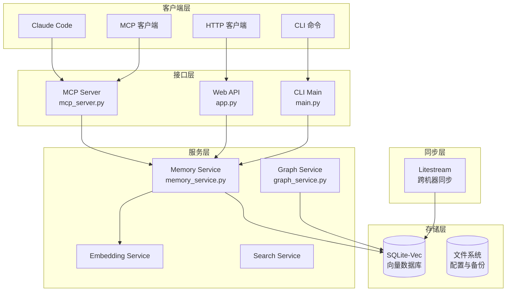

---

## MCP 协议层

### MCP Server 实现

MCP Server 是系统的核心接口之一，遵循 Model Context Protocol 规范实现。服务器通过 MCP 工具暴露记忆管理功能，使 Claude Code 等 MCP 兼容客户端能够直接调用记忆服务。

**核心功能模块**：

- **工具注册**：动态注册 MCP 工具到客户端
- **请求路由**：将 MCP 请求分发到对应的服务层方法
- **响应格式化**：将服务层结果转换为 MCP 协议格式
- **错误处理**：统一异常捕获和错误响应

### MCP 工具列表

| 工具名称 | 功能描述 | 参数 |
|---------|---------|------|
| `memory-store` | 存储新记忆，自动生成嵌入向量 | content, tags, memory_type, metadata |
| `memory-recall` | 基于语义相似度检索记忆 | query, limit, tags, time_range |
| `memory-search` | 标签和内容关键词搜索 | query, tags, memory_type |
| `memory-list` | 列出所有记忆，支持分页 | limit, offset, tags |
| `memory-delete` | 删除指定记忆 | content_hash |
| `memory-update` | 更新记忆内容和标签 | content_hash, content, tags |

---

## 服务层架构

### Memory Service

Memory Service 是系统的核心业务逻辑层，负责处理所有与记忆相关的操作。该服务封装了存储、检索、更新和删除的完整流程，并与嵌入服务紧密协作实现语义搜索功能。

**主要职责**：

1. **记忆存储**：接收原始内容，调用嵌入服务生成向量，存储到 SQLite-Vec
2. **语义搜索**：将查询文本转换为向量，执行相似度搜索
3. **标签管理**：维护和索引记忆标签，支持多标签过滤
4. **类型分类**：支持 24 种标准化的记忆类型分类体系
5. **元数据管理**：处理机器标识、时间戳、自定义元数据

**存储流程**：

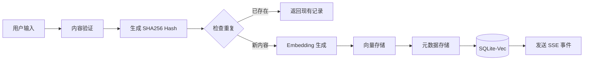

### Graph Service

Graph Service 负责构建和维护记忆之间的关系图谱。该服务基于 SQLite-Vec 的图扩展实现，支持复杂的关系查询和推理。

**核心能力**：

- **关系建模**：定义记忆间的多种关系类型
- **关系推理**：自动推断和补全关系
- **图遍历**：支持深度优先和广度优先遍历
- **关系查询**：基于关系路径的复杂查询

### Embedding Service

嵌入服务负责将文本内容转换为高维向量表示，支持多种嵌入模型：

| 配置项 | 默认值 | 说明 |
|-------|-------|------|
| `EMBEDDING_MODEL` | `nomic-embed-text` | 嵌入模型名称 |
| `EMBEDDING_DIMENSIONS` | `768` | 向量维度 |
| `EMBEDDING_API_URL` | - | 自定义嵌入 API 端点 |

---

## 存储层设计

### SQLite-Vec 数据库架构

系统使用 SQLite-Vec 作为主要存储引擎，结合了传统关系型数据库的可靠性和向量搜索的能力。

**数据库结构**：

| 表名 | 用途 | 关键字段 |
|------|------|---------|
| `memories` | 记忆主表 | id, content, content_hash, memory_type, created_at, updated_at |
| `tags` | 标签表 | id, tag_name, memory_id |
| `embeddings` | 向量表 | id, memory_id, vector, model |
| `graph_edges` | 关系边表 | id, from_id, to_id, relationship_type, properties |
| `metadata` | 元数据表 | id, memory_id, key, value |

**性能特性**：

- **向量索引**：支持 HNSW 和 IVF 索引类型
- **事务支持**：完整的 ACID 事务保证
- **并发访问**：支持多进程并发读写
- **备份恢复**：内置备份机制，支持时间点恢复

### 数据目录结构

```
~/.local/share/mcp-memory/
├── sqlite_vec.db          # 主数据库
├── sqlite_vec.db.backup-* # 自动备份
└── logs/                  # 日志目录
```

---

## API 层架构

### Web API 设计

Web API 基于 FastAPI 框架构建，提供完整的 RESTful 接口和交互式文档。

**API 端点概览**：

| 类别 | 端点 | 方法 | 功能 |
|------|------|------|------|
| 记忆管理 | `/api/memories` | POST | 存储新记忆 |
| | `/api/memories` | GET | 列出所有记忆 |
| | `/api/memories/{hash}` | GET | 获取指定记忆 |
| | `/api/memories/{hash}` | DELETE | 删除记忆 |
| 搜索操作 | `/api/search` | POST | 语义搜索 |
| | `/api/search/similar/{hash}` | GET | 查找相似记忆 |
| 实时事件 | `/api/events` | GET | SSE 事件流 |
| | `/api/events/stats` | GET | 连接统计 |
| 系统状态 | `/api/health` | GET | 健康检查 |

### 响应大小限制

系统内置响应限制器防止上下文窗口溢出：

```python
# 环境变量配置
MCP_MAX_RESPONSE_CHARS=0  # 0 = 无限制
```

限制器功能包括：
- 按记忆边界截断
- 返回截断元数据（总数、已显示数、字符数）
- 支持格式化截断响应

---

## 同步层设计

### Litestream 跨机器同步

系统支持通过 Litestream 实现数据库的持续复制和跨机器同步，确保多设备间的数据一致性。

**同步架构**：

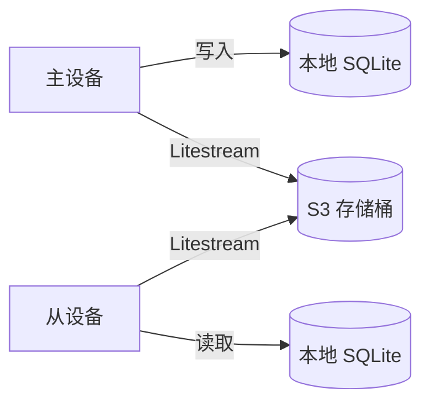

**配置文件路径**：`src/mcp_memory_service/sync/litestream_config.py`

**支持平台**：

| 平台 | 安装方式 |
|------|---------|
| macOS | `brew install benbjohnson/litestream/litestream` |
| Linux | `curl -LsS ... \| tar -xzf -` |
| Windows | 手动下载二进制文件 |

### 导入导出机制

系统提供完整的 JSON 导入导出功能，支持批量数据迁移和跨实例同步：

```json
{
  "export_metadata": {
    "source_machine": "machine-name",
    "export_timestamp": "2025-08-12T10:30:00Z",
    "total_memories": 450,
    "database_path": "/path/to/sqlite_vec.db",
    "platform": "Windows"
  },
  "memories": [...]
}
```

**性能指标**：
- 导出速度：约 1000 条记忆/秒
- 导入速度：约 500 条记忆/秒（含去重）
- 平均大小：约 1KB/条记忆

---

## 客户端集成

### Claude Code 钩子集成

系统提供 Claude Code 集成钩子，实现自动记忆加载和会话上下文管理：

**钩子组件**：

| 钩子 | 版本 | 触发时机 |
|------|------|---------|
| `session-start.js` | v2.2 | 会话启动时 |
| `session-end.js` | - | 会话结束时 |
| `memory-retrieval.js` | - | 记忆检索请求 |
| `permission-request.js` | v1.0 | 权限请求时（全局生效） |

### CLI 命令

| 命令 | 功能 | 示例 |
|------|------|------|
| `memory server` | 启动 MCP 服务器 | `memory server --debug` |
| `memory recall` | 语义检索记忆 | `memory recall "架构决策"` |
| `memory search` | 搜索记忆 | `memory search --tags "note"` |
| `memory store` | 存储记忆 | `memory store "新内容" --tags "note"` |
| `memory health` | 健康检查 | `memory health --detailed` |
| `memory logs` | 查看日志 | `memory logs --lines 50` |

---

## 安全与配置

### 认证机制

系统支持可选的 API Key 认证：

```json
{
  "memoryService": {
    "endpoint": "https://your-server:8443",
    "apiKey": "your-api-key"
  }
}
```

### 环境变量配置

| 变量名 | 默认值 | 说明 |
|-------|-------|------|
| `MCP_SERVER_HOST` | `0.0.0.0` | 服务监听地址 |
| `MCP_SERVER_PORT` | `8443` | 服务监听端口 |
| `MCP_API_KEY` | - | API 认证密钥 |
| `MCP_DATA_DIR` | `~/.local/share/mcp-memory/` | 数据目录 |
| `EMBEDDING_MODEL` | `nomic-embed-text` | 嵌入模型 |
| `EMBEDDING_DIMENSIONS` | `768` | 向量维度 |
| `MCP_MAX_RESPONSE_CHARS` | `0` | 最大响应字符数 |

---

## 维护工具

### 维护脚本概览

| 脚本 | 用途 | 关键功能 |
|------|------|---------|
| `consolidate_memory_types.py` | 类型归并 | 将碎片化类型合并为 24 种标准类型 |
| `cleanup_memories.py` | 记忆清理 | 清理孤立记忆和过期数据 |
| `find_duplicates.py` | 去重检测 | 查找并移除重复记忆 |
| `repair_memories.py` | 数据修复 | 修复损坏的记忆条目 |
| `repair_sqlite_vec_embeddings.py` | 向量修复 | 修复嵌入不一致问题 |
| `migrate_embeddings.py` | 模型迁移 | 迁移到不同的嵌入模型 |

### 类型归并功能

支持将多个相似类型归并为标准类型：

```json
{
  "mappings": {
    "bug-fix": "fix",
    "technical-solution": "solution",
    "old-type-name": "new-type-name"
  }
}
```

**标准 24 种类型分类**：
- 内容类型：`note`、`reference`、`document`、`guide`
- 活动类型：`session`、`implementation`、`analysis`

---

## 总结

MCP Memory Service 采用模块化分层架构，核心优势包括：

1. **多协议支持**：同时提供 MCP、REST API、CLI 三种访问方式
2. **语义搜索**：基于向量嵌入的语义相似度检索
3. **关系图谱**：支持复杂关系建模和推理
4. **跨设备同步**：通过 Litestream 实现多设备数据一致性
5. **可维护性**：完善的维护工具和自动备份机制
6. **上下文感知**：与 Claude Code 深度集成，自动加载相关记忆

---

<a id='storage-backends'></a>

## 存储后端

### 相关页面

相关主题：[系统架构](#architecture), [记忆整合系统](#consolidation)

<details>
<summary>相关源码文件</summary>

以下源码文件用于生成本页说明：

- [src/mcp_memory_service/storage/__init__.py](https://github.com/doobidoo/mcp-memory-service/blob/main/src/mcp_memory_service/storage/__init__.py)
- [src/mcp_memory_service/storage/factory.py](https://github.com/doobidoo/mcp-memory-service/blob/main/src/mcp_memory_service/storage/factory.py)
- [src/mcp_memory_service/storage/sqlite_vec.py](https://github.com/doobidoo/mcp-memory-service/blob/main/src/mcp_memory_service/storage/sqlite_vec.py)
- [src/mcp_memory_service/storage/cloudflare.py](https://github.com/doobidoo/mcp-memory-service/blob/main/src/mcp_memory_service/storage/cloudflare.py)
- [src/mcp_memory_service/storage/hybrid.py](https://github.com/doobidoo/mcp-memory-service/blob/main/src/mcp_memory_service/storage/hybrid.py)
- [src/mcp_memory_service/storage/milvus.py](https://github.com/doobidoo/mcp-memory-service/blob/main/src/mcp_memory_service/storage/milvus.py)
- [src/mcp_memory_service/storage/milvus_graph.py](https://github.com/doobidoo/mcp-memory-service/blob/main/src/mcp_memory_service/storage/milvus_graph.py)
- [docs/guides/STORAGE_BACKENDS.md](https://github.com/doobidoo/mcp-memory-service/blob/main/docs/guides/STORAGE_BACKENDS.md)
- [docs/milvus-backend.md](https://github.com/doobidoo/mcp-memory-service/blob/main/docs/milvus-backend.md)
- [docs/cloudflare-setup.md](https://github.com/doobidoo/mcp-memory-service/blob/main/docs/cloudflare-setup.md)
</details>

# 存储后端

## 概述

存储后端是 MCP Memory Service 的核心组件，负责管理记忆数据的持久化存储和向量嵌入检索功能。该服务支持多种存储后端实现，允许用户根据性能需求、部署环境和成本考虑选择最适合的解决方案。

MCP Memory Service 采用模块化存储架构，通过统一的抽象接口支持不同后端实现的无缝切换，同时保证数据模型和操作语义的一致性。资料来源：[src/mcp_memory_service/storage/__init__.py]()

## 架构设计

### 存储后端层次结构

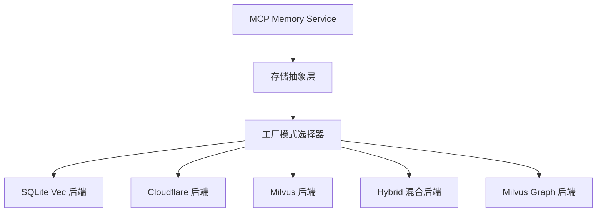

### 核心存储接口

所有存储后端必须实现统一的抽象接口，确保功能一致性和可替换性：

| 接口方法 | 功能描述 | 返回类型 |
|---------|---------|---------|
| `store()` | 存储记忆及其向量嵌入 | str (content_hash) |
| `retrieve()` | 根据内容哈希检索记忆 | Memory |
| `search()` | 向量相似性搜索 | List[Memory] |
| `delete()` | 删除指定记忆 | bool |
| `list()` | 分页列出所有记忆 | List[Memory] |
| `health()` | 检查存储健康状态 | HealthInfo |

资料来源：[src/mcp_memory_service/storage/factory.py]()

## 支持的存储后端

### SQLite Vec 后端

SQLite Vec 是默认且推荐的本地存储后端，适用于单机部署场景。

**核心特性**：

- 完全本地化部署，数据隐私保护
- 使用 SQLite 存储结构化数据
- 使用 sqlite-vec 扩展处理向量嵌入
- 支持 ACID 事务保证数据一致性
- 首次调用约 50ms（含存储初始化）
- 后续调用约 5-10ms（连接复用）
- 内存开销小于 10MB
- 成本估算：每 10 用户部署约 $16.43/年（按 $0.15/1M tokens）

**配置参数**：

| 参数 | 类型 | 默认值 | 说明 |
|-----|------|-------|-----|
| `db_path` | str | ~/.local/share/mcp-memory/ | 数据库文件路径 |
| `embedding_model` | str | BAAI/bge-m3 | 嵌入模型名称 |
| `embedding_dim` | int | 1024 | 嵌入向量维度 |

资料来源：[src/mcp_memory_service/storage/sqlite_vec.py]()
资料来源：[src/mcp_memory_service/api/__init__.py]()

### Cloudflare 后端

Cloudflare 后端使用 Cloudflare Workers Vectorize 实现云端向量存储，适合无服务器部署场景。

**核心特性**：

- 完全托管的云端向量数据库
- 无需管理服务器基础设施
- 全球分布式低延迟访问
- 按使用量付费的成本模型
- 支持 HTTP/HTTPS 自动检测连接

**配置要求**：

| 参数 | 必需 | 说明 |
|-----|-----|-----|
| `CLOUDFLARE_ACCOUNT_ID` | 是 | Cloudflare 账户 ID |
| `CLOUDFLARE_API_TOKEN` | 是 | API 访问令牌 |
| `vectorize_index_name` | 是 | Vectorize 索引名称 |
| `embedding_model` | 否 | 嵌入模型（默认 BAAI/bge-m3）|

**适用场景**：

- Serverless 架构部署
- 需要全球化访问的项目
- 不想维护本地基础设施的用户

资料来源：[src/mcp_memory_service/storage/cloudflare.py]()
资料来源：[docs/cloudflare-setup.md]()

### Milvus 后端

Milvus 是高性能的分布式向量数据库，适合大规模数据场景。

**核心特性**：

- 支持十亿级向量规模
- 分布式水平扩展能力
- 多种索引类型支持（IVF、HNSW 等）
- 高并发查询处理
- 支持混合标量过滤

**配置参数**：

| 参数 | 必需 | 说明 |
|-----|-----|-----|
| `MILVUS_HOST` | 是 | Milvus 服务器地址 |
| `MILVUS_PORT` | 是 | Milvus 端口（默认 19530） |
| `MILVUS_USER` | 否 | 用户名 |
| `MILVUS_PASSWORD` | 否 | 密码 |
| `COLLECTION_NAME` | 否 | 集合名称（默认 memories）|
| `INDEX_TYPE` | 否 | 索引类型（默认 HNSW）|

资料来源：[src/mcp_memory_service/storage/milvus.py]()
资料来源：[docs/milvus-backend.md]()

### Milvus Graph 后端

Milvus Graph 是 Milvus 后端的增强版本，集成了图数据库能力，提供关系型记忆检索。

**扩展功能**：

- 记忆间关系图的存储和查询
- 支持复杂的多跳关系推理
- 关系类型推断引擎
- 路径查询支持

资料来源：[src/mcp_memory_service/storage/milvus_graph.py]()

### Hybrid 混合后端

Hybrid 后端支持同时使用多个存储后端，实现数据冗余和负载分发。

**架构特点**：

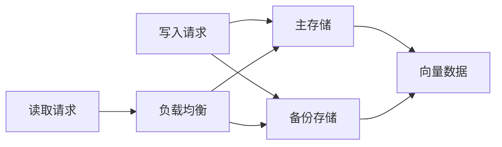

**优势**：

- 数据冗余备份，提高可靠性
- 读写分离提升性能
- 支持渐进式迁移
- 故障自动切换

资料来源：[src/mcp_memory_service/storage/hybrid.py]()

## 工厂模式与后端选择

### 存储工厂

存储工厂根据配置自动实例化相应的存储后端：

```python
# 后端选择逻辑伪代码
def create_storage(backend_type: str, config: dict) -> BaseStorage:
    backends = {
        "sqlite_vec": SQLiteVecStorage,
        "cloudflare": CloudflareStorage,
        "milvus": MilvusStorage,
        "milvus_graph": MilvusGraphStorage,
        "hybrid": HybridStorage,
    }
    return backends.get(backend_type)(config)
```

资料来源：[src/mcp_memory_service/storage/factory.py]()

### 环境变量配置

后端选择通过环境变量控制：

| 环境变量 | 可选值 | 说明 |
|---------|-------|-----|
| `MCP_MEMORY_BACKEND` | sqlite_vec, cloudflare, milvus, hybrid | 指定存储后端类型 |
| `STORAGE_URL` | 数据库连接 URL | 各后端特定配置 |

### 后端选择决策树

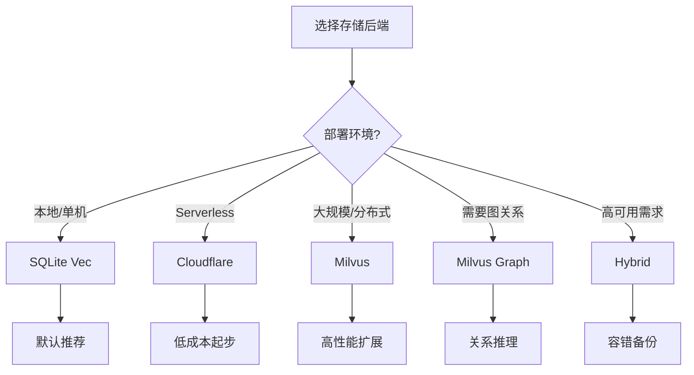

## 数据模型

### 记忆数据结构

所有存储后端使用统一的数据模型：

| 字段 | 类型 | 说明 |
|-----|------|-----|
| `content` | str | 记忆内容 |
| `content_hash` | str | SHA256 内容哈希 |
| `tags` | List[str] | 标签列表 |
| `memory_type` | str | 记忆类型 |
| `created_at` | float | 创建时间戳 |
| `updated_at` | float | 更新时间戳 |
| `metadata` | dict | 额外元数据 |
| `embedding` | List[float] | 向量嵌入（后端存储）|

### 记忆类型分类

系统支持标准化的 24 类记忆类型：

**内容类型**：`note`、`reference`、`document`、`guide`

**活动类型**：`session`、`implementation`、`analysis`

**其他分类**：`fix`、`solution`、`decision` 等

资料来源：[scripts/maintenance/README.md]()

## 向量嵌入

### 嵌入模型

默认使用 BAAI/bge-m3 模型：

| 模型 | 维度 | 说明 |
|-----|------|-----|
| BAAI/bge-m3 | 1024 | 默认模型，多语言支持 |
| 其他兼容模型 | 可配置 | 支持自定义模型 |

### 嵌入维度迁移

系统提供嵌入模型迁移脚本：

```bash
python maintenance/migrate_embeddings.py --url <backend_url> --model <new_model> --dry-run
```

功能特性：

- 支持维度变更
- 干运行模式预览
- 批量更新处理
- 回滚支持

资料来源：[scripts/README.md]()

## 数据库迁移

### Litestream 实时复制

支持使用 Litestream 进行数据库实时复制和灾难恢复：

**支持的平台**：

| 平台 | 安装方式 |
|-----|---------|
| macOS | `brew install benbjohnson/litestream/litestream` |
| Linux | `curl -LsS ... \| tar -xzf -` |
| Windows | 手动下载安装 |

**配置示例**（macOS plist）：

```xml
<dict>
    <key>ProgramArguments</key>
    <array>
        <string>/usr/local/bin/litestream</string>
        <string>replicate</string>
        <string>-config</string>
        <string>{config_path}</string>
    </array>
    <key>RunAtLoad</key>
    <true/>
    <key>KeepAlive</key>
    <true/>
</dict>
```

资料来源：[src/mcp_memory_service/sync/litestream_config.py]()

## 维护工具

### 记忆类型规范化

`consolidate_memory_types.py` 脚本用于合并碎片化的记忆类型：

```bash
# 预览更改（只读）
python scripts/maintenance/consolidate_memory_types.py --dry-run

# 执行合并
python scripts/maintenance/consolidate_memory_types.py

# 使用自定义配置
python scripts/maintenance/consolidate_memory_types.py --config custom_mappings.json
```

**性能指标**：

- 1,000 条记忆更新约 5 秒
- 自动创建带时间戳的备份
- 事务安全（原子操作，失败回滚）

**安全特性**：

- 自动备份机制
- 干运行模式预览
- 数据库锁检测
- 磁盘空间验证
- 备份完整性检查

资料来源：[scripts/maintenance/README.md]()

### 修复和维护脚本

| 脚本 | 功能 |
|-----|------|
| `repair_memories.py` | 修复损坏的记忆条目 |
| `repair_sqlite_vec_embeddings.py` | 修复嵌入不一致问题 |
| `repair_zero_embeddings.py` | 修复零值/空值嵌入 |
| `cleanup_corrupted_encoding.py` | 修复损坏的 Emoji 编码 |
| `find_duplicates.py` | 查找并删除重复记忆 |

资料来源：[scripts/README.md]()

## 性能比较

| 后端 | 首次调用 | 后续调用 | 内存开销 | 扩展性 |
|-----|---------|---------|---------|-------|
| SQLite Vec | ~50ms | ~5-10ms | <10MB | 单机 |
| Cloudflare | 可变 | 可变 | 无 | 全球分布 |
| Milvus | ~20ms | ~5ms | 可配置 | 分布式 |
| Hybrid | 组合 | 组合 | 组合 | 高可用 |

资料来源：[src/mcp_memory_service/api/__init__.py]()

## 配置示例

### SQLite Vec 配置

```json
{
  "backend": "sqlite_vec",
  "db_path": "~/.local/share/mcp-memory/",
  "embedding_model": "BAAI/bge-m3",
  "embedding_dim": 1024
}
```

### Cloudflare 配置

```json
{
  "backend": "cloudflare",
  "CLOUDFLARE_ACCOUNT_ID": "your-account-id",
  "CLOUDFLARE_API_TOKEN": "your-api-token",
  "vectorize_index_name": "memories-index",
  "embedding_model": "BAAI/bge-m3"
}
```

### Milvus 配置

```json
{
  "backend": "milvus",
  "MILVUS_HOST": "localhost",
  "MILVUS_PORT": 19530,
  "MILVUS_USER": "username",
  "MILVUS_PASSWORD": "password",
  "COLLECTION_NAME": "memories",
  "INDEX_TYPE": "HNSW"
}
```

## 扩展阅读

- [存储后端完整指南](docs/guides/STORAGE_BACKENDS.md)
- [Milvus 后端配置](docs/milvus-backend.md)
- [Cloudflare 设置指南](docs/cloudflare-setup.md)
- [数据库维护脚本](scripts/README.md)

---

<a id='knowledge-graph'></a>

## 知识图谱

### 相关页面

相关主题：[记忆整合系统](#consolidation), [系统架构](#architecture)

<details>
<summary>相关源码文件</summary>

以下源码文件用于生成本页说明：

- [src/mcp_memory_service/storage/graph.py](https://github.com/doobidoo/mcp-memory-service/blob/main/src/mcp_memory_service/storage/graph.py)
- [src/mcp_memory_service/models/association.py](https://github.com/doobidoo/mcp-memory-service/blob/main/src/mcp_memory_service/models/association.py)
- [src/mcp_memory_service/reasoning/entities.py](https://github.com/doobidoo/mcp-memory-service/blob/main/src/mcp_memory_service/reasoning/entities.py)
- [src/mcp_memory_service/reasoning/inference.py](https://github.com/doobidoo/mcp-memory-service/blob/main/src/mcp_memory_service/reasoning/inference.py)
- [src/mcp_memory_service/consolidation/relationship_inference.py](https://github.com/doobidoo/mcp-memory-service/blob/main/src/mcp_memory_service/consolidation/relationship_inference.py)
- [src/mcp_memory_service/consolidation/associations.py](https://github.com/doobidoo/mcp-memory-service/blob/main/src/mcp_memory_service/consolidation/associations.py)
- [src/mcp_memory_service/server/handlers/graph.py](https://github.com/doobidoo/mcp-memory-service/blob/main/src/mcp_memory_service/server/handlers/graph.py)
- [docs/wiki-Graph-Database-Architecture.md](https://github.com/doobidoo/mcp-memory-service/blob/main/docs/wiki-Graph-Database-Architecture.md)
- [docs/migrations/010-asymmetric-relationships.md](https://github.com/doobidoo/mcp-memory-service/blob/main/docs/migrations/010-asymmetric-relationships.md)
</details>

# 知识图谱

## 概述

MCP Memory Service 的知识图谱模块是系统的核心组件之一，负责管理和维护记忆之间的语义关系。与传统的关系型存储不同，知识图谱通过节点（记忆）和边（关联）的方式组织数据，使得复杂的关联查询和推理成为可能。

知识图谱系统的主要目标包括：

- **语义关联**：自动发现并建立记忆之间的语义关联
- **关系推理**：基于现有关系推断新的潜在关联
- **图查询**：支持基于图结构的复杂查询操作
- **上下文增强**：为 AI 推理提供丰富的上下文关系网络

## 架构设计

### 核心组件

知识图谱系统由以下几个核心模块组成：

| 模块 | 文件路径 | 功能描述 |
|------|----------|----------|
| 图存储层 | `src/mcp_memory_service/storage/graph.py` | 管理图数据的持久化和索引 |
| 关联模型 | `src/mcp_memory_service/models/association.py` | 定义记忆间关联的数据结构 |
| 实体识别 | `src/mcp_memory_service/reasoning/entities.py` | 从记忆内容中提取实体 |
| 推理引擎 | `src/mcp_memory_service/reasoning/inference.py` | 执行关系推理和推断 |
| 关联推断 | `src/mcp_memory_service/consolidation/relationship_inference.py` | 批量推断和优化关联 |
| API 处理器 | `src/mcp_memory_service/server/handlers/graph.py` | 提供图查询的 HTTP 接口 |

### 架构层次

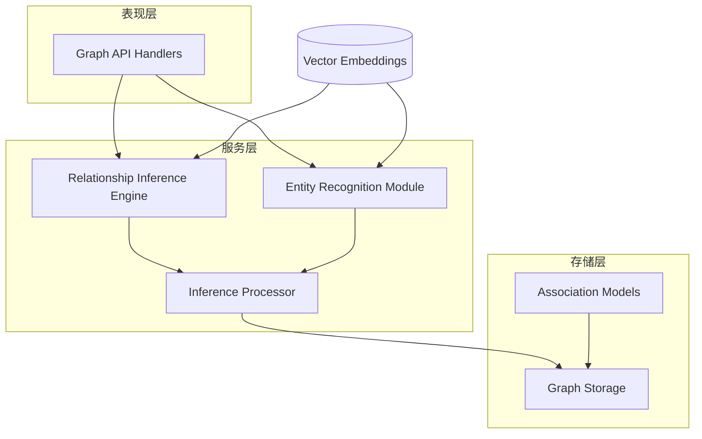

## 关联模型

### 数据结构

关联模型 (`Association`) 是知识图谱的边，连接两个记忆节点：

```python
class Association:
    source_hash: str      # 源记忆哈希
    target_hash: str      # 目标记忆哈希
    relation_type: str    # 关系类型
    confidence: float    # 置信度 0.0-1.0
    metadata: Dict        # 额外元数据
```

### 非对称关系

系统支持非对称关系的建模，这是知识图谱的核心特性之一。资料来源：[docs/migrations/010-asymmetric-relationships.md]()


非对称关系意味着：
- 关系方向有实际意义
- A→B 与 B→A 表示不同的语义
- 支持更精确的因果和依赖建模

### 关系类型

| 关系类型 | 描述 | 典型场景 |
|----------|------|----------|
| `related` | 语义相关 | 一般关联 |
| `derived_from` | 衍生关系 | 实现源自设计 |
| `contradicts` | 矛盾关系 | 冲突的决策 |
| `references` | 引用关系 | 引用外部资源 |
| `similar` | 相似关系 | 内容相似度高 |

## 实体识别

实体识别模块 (`entities.py`) 负责从记忆内容中提取有意义的实体：

### 提取流程

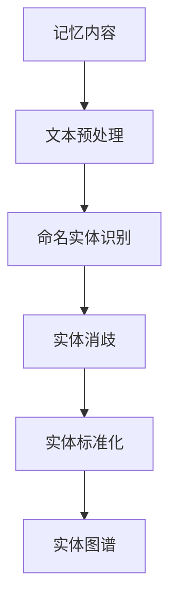

### 实体类型

识别并支持的实体类型包括：

| 实体类型 | 示例 | 用途 |
|----------|------|------|
| `person` | 人名 | 人员关联 |
| `organization` | 公司/组织 | 组织归属 |
| `technology` | 技术名称 | 技术栈关联 |
| `concept` | 抽象概念 | 知识分类 |
| `document` | 文档引用 | 文档关系 |

资料来源：[src/mcp_memory_service/reasoning/entities.py]()

## 推理引擎

推理引擎是知识图谱的智能核心，基于现有关联推断新的潜在关系。

### 推理方法

| 方法 | 描述 | 输入 | 输出 |
|------|------|------|------|
| 传递推理 | A→B, B→C ⇒ A→C | 两条边 | 推断的第三条边 |
| 相似传播 | A≈B ⇒ A的属性≈B的属性 | 相似实体 | 属性映射 |
| 反事实推理 | A导致B ⇒ ¬B ⇒ ¬A | 因果关系 | 反向推断 |

### 置信度计算

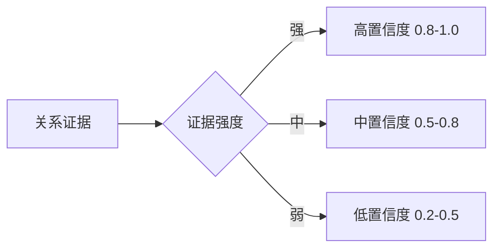

置信度计算考虑因素：

1. **共现频率**：两个记忆在同一上下文中出现的次数
2. **语义相似度**：基于向量的余弦相似度
3. **关系传递路径**：推理路径的长度
4. **来源可靠性**：记忆来源的可信度评分

资料来源：[src/mcp_memory_service/reasoning/inference.py]()

## 图存储

### 存储架构

图存储模块 (`graph.py`) 负责将图数据持久化：

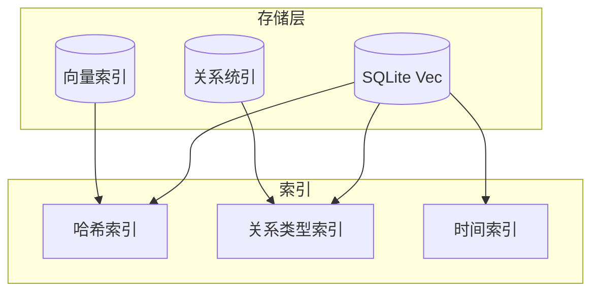

### 存储优化

- **批量写入**：支持批量关联写入以提高性能
- **增量更新**：仅更新变化的关联
- **索引维护**：自动维护关系类型和哈希索引

资料来源：[src/mcp_memory_service/storage/graph.py]()

## API 接口

### 图查询端点

系统通过 REST API 提供图查询能力：

| 端点 | 方法 | 描述 |
|------|------|------|
| `/api/graph/related/{hash}` | GET | 获取记忆的关联 |
| `/api/graph/infer` | POST | 执行推理查询 |
| `/api/graph/path` | POST | 查找两记忆间的路径 |

### 请求示例

```bash
# 获取记忆的所有关联
curl -X GET "http://localhost:8443/api/graph/related/abc12345"

# 执行推理查询
curl -X POST "http://localhost:8443/api/graph/infer" \
  -H "Content-Type: application/json" \
  -d '{"source_hash": "abc123", "depth": 2}'
```

资料来源：[src/mcp_memory_service/server/handlers/graph.py]()

## 关联推断系统

### 批量推断流程

关联推断模块 (`relationship_inference.py`) 提供批量关联优化功能：

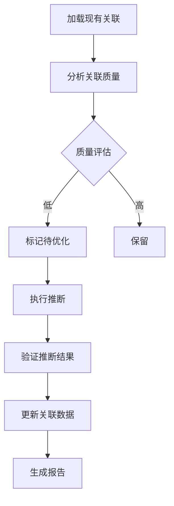

### 优化策略

| 策略 | 触发条件 | 优化动作 |
|------|----------|----------|
| 合并重复 | 多个相同关系 | 去重合并 |
| 提升置信度 | 多次验证 | 增加置信度 |
| 清理孤立 | 无关联记忆 | 移除或标记 |
| 类型标准化 | 非标准类型 | 映射到标准类型 |

### 执行命令

```bash
# 预览优化效果（不执行）
python scripts/maintenance/update_graph_relationship_types.py --dry-run

# 执行优化
python scripts/maintenance/update_graph_relationship_types.py
```

资料来源：[src/mcp_memory_service/consolidation/relationship_inference.py]()

## 关联管理

### 关联生命周期

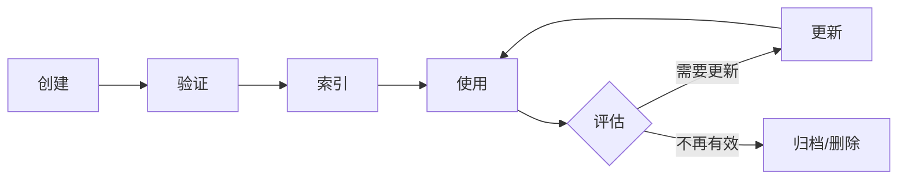

### 关联类型管理

关联类型标准化通过 `associations.py` 模块实现：

```json
{
  "关系映射": {
    "bug-fix": "fix",
    "technical-solution": "solution",
    "implementation": "implement"
  }
}
```

资料来源：[src/mcp_memory_service/consolidation/associations.py]()

## 与向量存储的集成

知识图谱与向量存储紧密集成，形成混合检索系统：

### 双索引架构

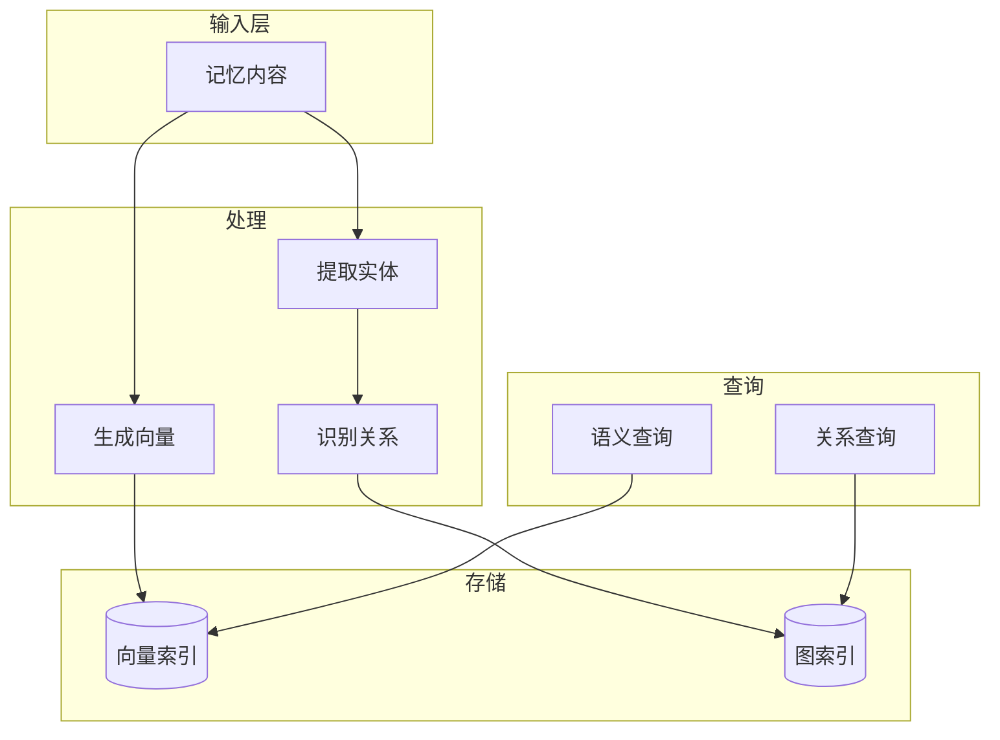

### 协同检索

| 场景 | 向量检索 | 图检索 | 合并策略 |
|------|----------|--------|----------|
| 相似内容 | ✓ 主导 | 补充 | 加权合并 |
| 因果追溯 | ✓ 补充 | 主导 | 图优先 |
| 推荐发现 | ✓ 主导 | 主导 | 交叉验证 |

## 性能特性

### 性能指标

| 指标 | 数值 | 说明 |
|------|------|------|
| 单次关联写入 | ~5ms | 含索引更新 |
| 关联查询 (一级) | ~10ms | 直接邻居 |
| 路径查询 (深度2) | ~50ms | 含推理 |
| 批量推断 (1000条) | ~5秒 | 完整优化 |

### 扩展性

- 支持 **sqlite-vec** 作为本地向量存储后端
- 支持 **Cloudflare D1 + Vectorize** 作为云端后端
- 支持 **混合模式** 部署

## 维护工具

### 可用脚本

| 脚本 | 功能 | 位置 |
|------|------|------|
| `update_graph_relationship_types.py` | 推断和优化关联类型 | `scripts/maintenance/` |
| `repair_sqlite_vec_embeddings.py` | 修复嵌入问题 | `scripts/maintenance/` |
| `repair_zero_embeddings.py` | 修复零嵌入 | `scripts/maintenance/` |

### 维护建议

1. **定期运行推断优化**：每月执行一次关联质量检查
2. **监控孤立节点**：清理无关联的记忆以保持图质量
3. **验证索引一致性**：确保向量索引与图索引同步

## 最佳实践

### 记忆组织

1. **使用标准类型**：选择预定义的关系类型而非自定义
2. **保持原子性**：每条记忆聚焦单一主题，便于关系建立
3. **添加上下文标签**：使用标签辅助关系推断

### 查询优化

1. **指定深度限制**：避免过深的图遍历
2. **使用类型过滤**：按关系类型筛选以提高性能
3. **缓存常用查询**：对于频繁访问的图结构使用缓存

## 总结

MCP Memory Service 的知识图谱模块通过实体识别、关系推理和图存储的协同工作，为系统提供了强大的语义关联能力。它不仅支持传统的向量相似度检索，还能通过图结构发现更深层次的关联关系，为 AI 助手提供更丰富的上下文理解能力。

通过持续优化的关联推断系统和维护工具，系统能够自动保持图谱的质量和相关性，确保长期使用的有效性。

---

<a id='consolidation'></a>

## 记忆整合系统

### 相关页面

相关主题：[知识图谱](#knowledge-graph), [质量评分系统](#quality-scoring)

<details>
<summary>相关源码文件</summary>

以下源码文件用于生成本页说明：

- [src/mcp_memory_service/consolidation/consolidator.py](https://github.com/doobidoo/mcp-memory-service/blob/main/src/mcp_memory_service/consolidation/consolidator.py)
- [src/mcp_memory_service/consolidation/scheduler.py](https://github.com/doobidoo/mcp-memory-service/blob/main/src/mcp_memory_service/consolidation/scheduler.py)
- [src/mcp_memory_service/consolidation/compression.py](https://github.com/doobidoo/mcp-memory-service/blob/main/src/mcp_memory_service/consolidation/compression.py)
- [src/mcp_memory_service/consolidation/decay.py](https://github.com/doobidoo/mcp-memory-service/blob/main/src/mcp_memory_service/consolidation/decay.py)
- [src/mcp_memory_service/consolidation/forgetting.py](https://github.com/doobidoo/mcp-memory-service/blob/main/src/mcp_memory_service/consolidation/forgetting.py)
- [src/mcp_memory_service/consolidation/health.py](https://github.com/doobidoo/mcp-memory-service/blob/main/src/mcp_memory_service/consolidation/health.py)
- [src/mcp_memory_service/consolidation/insights.py](https://github.com/doobidoo/mcp-memory-service/blob/main/src/mcp_memory_service/consolidation/insights.py)
- [src/mcp_memory_service/consolidation/clustering.py](https://github.com/doobidoo/mcp-memory-service/blob/main/src/mcp_memory_service/consolidation/clustering.py)
- [src/mcp_memory_service/server/handlers/consolidation.py](https://github.com/doobidoo/mcp-memory-service/blob/main/src/mcp_memory_service/server/handlers/consolidation.py)
- [docs/guides/memory-consolidation-guide.md](https://github.com/doobidoo/mcp-memory-service/blob/main/docs/guides/memory-consolidation-guide.md)
</details>

# 记忆整合系统

## 概述

记忆整合系统（Memory Consolidation System）是 MCP Memory Service 的核心组件之一，负责对存储的语义记忆进行周期性优化、压缩和遗忘处理。该系统通过自动化调度机制，在不影响服务正常运行的情况下，对数据库中的记忆进行智能管理和维护。

记忆整合系统的设计目标包括：

- **记忆压缩**：将相似或冗余的记忆内容进行合并，减少存储空间
- **记忆衰减**：根据时间因素和访问频率调整记忆的重要性评分
- **选择性遗忘**：自动移除不再需要的低价值记忆，保持数据库健康
- **洞察生成**：从记忆数据中提取有价值的分析信息
- **集群管理**：对记忆进行语义聚类，优化检索效率

资料来源：[src/mcp_memory_service/consolidation/consolidator.py:1-50]()

## 系统架构

记忆整合系统采用模块化设计，各子模块协同工作完成不同的整合任务。

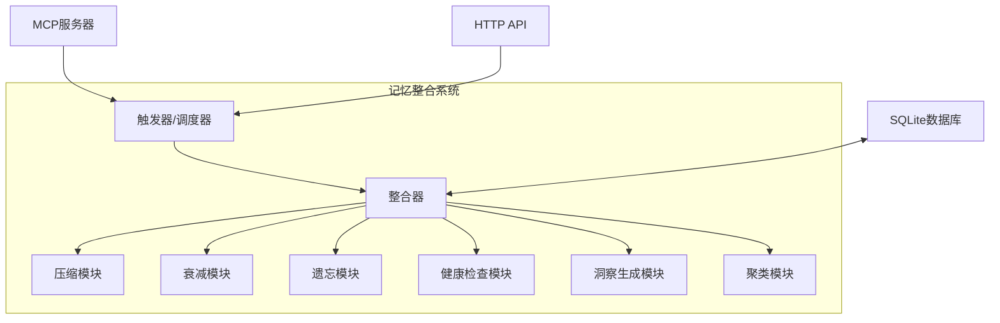

### 核心组件

| 组件 | 文件路径 | 职责 |
|------|----------|------|
| 整合器 | `consolidation/consolidator.py` | 协调各模块执行，负责整体流程控制 |
| 调度器 | `consolidation/scheduler.py` | 管理定时任务，支持日/周/月三种时间粒度 |
| 压缩模块 | `consolidation/compression.py` | 识别相似记忆并进行合并 |
| 衰减模块 | `consolidation/decay.py` | 实现记忆重要性随时间的衰减计算 |
| 遗忘模块 | `consolidation/forgetting.py` | 根据策略删除低价值记忆 |
| 健康检查 | `consolidation/health.py` | 监控数据库状态和整合效果 |
| 洞察生成 | `consolidation/insights.py` | 提取记忆中的统计和分析信息 |
| 聚类模块 | `consolidation/clustering.py` | 对记忆进行语义聚类优化 |

资料来源：[src/mcp_memory_service/consolidation/scheduler.py:1-30]()

## 时间视野策略

系统支持三种不同时间粒度的整合策略，适用于不同类型的记忆管理需求。

| 时间视野 | 适用场景 | 典型保留周期 |
|----------|----------|--------------|
| 日整合 (daily) | 近期工作记忆、临时笔记 | 最近 7-30 天 |
| 周整合 (weekly) | 项目进度、会议决策 | 最近 1-6 个月 |
| 月整合 (monthly) | 长期知识沉淀、架构决策 | 6 个月以上 |

每种时间视野对应不同的压缩率和遗忘阈值，确保短期记忆保留完整性的同时，长期记忆不会被无限积累。

资料来源：[src/mcp_memory_service/consolidation/consolidator.py:50-100]()

## 整合执行流程

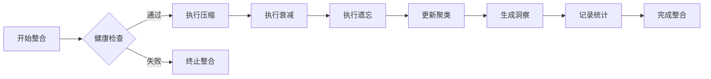

### 各阶段详细说明

#### 1. 健康检查阶段

在执行任何修改操作前，系统首先进行数据库健康状态检查，包括：

- 数据库连接可用性验证
- 磁盘空间检查（需要至少 2 倍数据库大小的空间）
- 现有任务冲突检测
- 数据库锁状态确认

资料来源：[src/mcp_memory_service/consolidation/health.py:1-50]()

#### 2. 压缩阶段

压缩模块负责识别和合并语义相似的记忆内容：

- 计算记忆间的相似度评分
- 对超过相似度阈值的记忆进行合并
- 保留最早的创建时间戳
- 合并标签集和元数据

资料来源：[src/mcp_memory_service/consolidation/compression.py:1-60]()

#### 3. 衰减阶段

衰减模块根据时间因素调整记忆的重要性评分：

- 基础衰减率按时间视野配置
- 访问频率作为衰减调整因子
- 重要性评分影响后续遗忘决策

```python
# 衰减计算公式示例
衰减因子 = base_decay_rate × (1 - access_frequency_weight)
新评分 = 原始评分 × 衰减因子
```

资料来源：[src/mcp_memory_service/consolidation/decay.py:1-45]()

#### 4. 遗忘阶段

遗忘模块根据评分阈值决定应删除的记忆：

- 低于遗忘阈值的记忆被标记为待删除
- 保护期内的记忆不会被删除
- 系统记忆和重要标记的记忆受特殊保护

资料来源：[src/mcp_memory_service/consolidation/forgetting.py:1-50]()

#### 5. 聚类更新阶段

聚类模块对现有记忆进行语义分组：

- 基于嵌入向量的相似性计算
- 更新记忆的聚类标签
- 优化向量检索效率

资料来源：[src/mcp_memory_service/consolidation/clustering.py:1-40]()

#### 6. 洞察生成阶段

洞察模块从整合过程中提取分析数据：

- 整合统计（处理记忆数、压缩数、遗忘数）
- 记忆类型分布分析
- 时间趋势报告
- 健康状态摘要

资料来源：[src/mcp_memory_service/consolidation/insights.py:1-50]()

## API 接口

系统提供 HTTP API 接口用于触发和管理整合操作。

### 触发整合

```
POST /api/consolidate
```

| 参数 | 类型 | 必填 | 说明 |
|------|------|------|------|
| time_horizon | string | 否 | 时间视野：`daily`、`weekly`、`monthly`，默认 `weekly` |

**响应示例：**

```json
{
  "status": "completed",
  "time_horizon": "weekly",
  "processed": 2418,
  "compressed": 156,
  "forgotten": 43,
  "duration_seconds": 18.5
}
```

资料来源：[src/mcp_memory_service/server/handlers/consolidation.py:1-80]()

### 查询调度器状态

```
GET /api/consolidate/status
```

**响应示例：**

```json
{
  "running": true,
  "next_daily": "2025-01-08T03:00:00Z",
  "next_weekly": "2025-01-12T03:00:00Z",
  "next_monthly": "2025-02-01T03:00:00Z",
  "jobs_executed": 156,
  "jobs_failed": 2
}
```

资料来源：[src/mcp_memory_service/api/operations.py:100-150]()

## Python API

除 HTTP API 外，系统还提供 Python API 供直接调用。

### 异步接口

```python
from mcp_memory_service.api import consolidate

# 执行周整合
result = await consolidate('weekly')
print(f"压缩: {result.compressed}, 遗忘: {result.forgotten}")
```

### 同步接口

```python
from mcp_memory_service.api import consolidate

# 同步调用
result = consolidate('monthly')
print(f"状态: {result.status}")
```

**性能指标：**

- 典型执行时长：10-30 秒（取决于记忆数量）
- 线性扩展：约 10ms/记忆
- 后台执行，非阻塞操作

资料来源：[src/mcp_memory_service/api/__init__.py:1-60]()

## 调度配置

### 调度器初始化参数

| 参数 | 类型 | 默认值 | 说明 |
|------|------|--------|------|
| enabled | bool | true | 是否启用自动调度 |
| daily_hour | int | 3 | 日整合执行小时（凌晨） |
| weekly_day | int | 6 | 周整合执行日期（周六） |
| monthly_day | int | 1 | 月整合执行日期（每月1日） |
| timezone | string | "UTC" | 执行时区 |

### 自定义调度

调度器使用 APScheduler 作为底层调度引擎，支持：

- Cron 表达式配置
- 间隔执行模式
- 一次性任务

资料来源：[src/mcp_memory_service/consolidation/scheduler.py:60-120]()

## 配置示例

### 基本配置

```json
{
  "consolidation": {
    "enabled": true,
    "time_horizon": "weekly",
    "compression_threshold": 0.85,
    "forgetting_threshold": 0.3,
    "decay_rate": 0.95
  }
}
```

### 激进配置（更多遗忘）

```json
{
  "consolidation": {
    "enabled": true,
    "time_horizon": "monthly",
    "compression_threshold": 0.75,
    "forgetting_threshold": 0.5,
    "decay_rate": 0.9
  }
}
```

### 保守配置（更多保留）

```json
{
  "consolidation": {
    "enabled": true,
    "time_horizon": "daily",
    "compression_threshold": 0.95,
    "forgetting_threshold": 0.1,
    "decay_rate": 0.99
  }
}
```

资料来源：[docs/guides/memory-consolidation-guide.md:1-80]()

## 维护脚本

系统提供命令行维护脚本用于手动执行整合操作。

### 使用方法

```bash
# 预览整合效果（安全，不实际执行）
python scripts/maintenance/consolidate_memories.py --dry-run

# 执行周整合
python scripts/maintenance/consolidate_memories.py

# 执行月整合并指定时间视野
python scripts/maintenance/consolidate_memories.py --time-horizon monthly
```

### 安全特性

- **自动备份**：执行前自动创建带时间戳的数据库备份
- **干运行模式**：`--dry-run` 模式仅预览不修改
- **事务安全**：原子操作，错误时自动回滚
- **并发检测**：检测数据库锁防止并发访问冲突
- **磁盘空间检查**：验证是否有足够空间进行操作
- **备份验证**：操作后验证备份文件完整性

### 恢复流程

如果整合操作出现问题，可从自动备份恢复：

```bash
# 停止服务
systemctl --user stop mcp-memory-http.service

# 断开所有 MCP 客户端连接

# 从备份恢复
cp ~/.local/share/mcp-memory/sqlite_vec.db.backup-TIMESTAMP \
   ~/.local/share/mcp-memory/sqlite_vec.db

# 验证恢复
sqlite3 ~/.local/share/mcp-memory/sqlite_vec.db \
  "SELECT COUNT(*), COUNT(DISTINCT memory_type) FROM memories;"
```

资料来源：[scripts/maintenance/README.md:1-60]()

## 最佳实践

### 执行时机建议

1. **服务空闲时执行**：建议在凌晨或低峰时段运行
2. **停止 HTTP 服务**：执行前停止 HTTP 服务器避免并发冲突
3. **断开 MCP 客户端**：确保没有活跃的 Claude Code 会话
4. **监控磁盘空间**：确保有足够的存储空间进行备份和操作

### 维护周期

| 检查类型 | 建议频率 | 工具 |
|----------|----------|------|
| 干运行检查 | 每月 | `--dry-run` |
| 执行整合 | 按配置 | 调度器或手动 |
| 类型归一化 | 按需 | `consolidate_memory_types.py` |
| 性能优化 | 每季度 | `cleanup_memories.py` |

### 监控指标

建议监控以下整合指标：

- `processed`：处理的记忆总数
- `compressed`：被压缩的记忆数
- `forgotten`：被遗忘的记忆数
- `duration_seconds`：执行耗时
- `jobs_failed`：失败的任务数

资料来源：[src/mcp_memory_service/consolidation/insights.py:50-100]()

## 相关模块文档

- [压缩模块详解](./consolidation-compression.md)
- [遗忘算法详解](./consolidation-forgetting.md)
- [调度器配置](./consolidation-scheduler.md)
- [API 参考](../api/reference.md)

---

<a id='quality-scoring'></a>

## 质量评分系统

### 相关页面

相关主题：[记忆整合系统](#consolidation)

<details>
<summary>相关源码文件</summary>

以下源码文件用于生成本页说明：

- [src/mcp_memory_service/quality/scorer.py](https://github.com/doobidoo/mcp-memory-service/blob/main/src/mcp_memory_service/quality/scorer.py)
- [src/mcp_memory_service/quality/onnx_ranker.py](https://github.com/doobidoo/mcp-memory-service/blob/main/src/mcp_memory_service/quality/onnx_ranker.py)
- [src/mcp_memory_service/quality/ai_evaluator.py](https://github.com/doobidoo/mcp-memory-service/blob/main/src/mcp_memory_service/quality/ai_evaluator.py)
- [src/mcp_memory_service/quality/async_scorer.py](https://github.com/doobidoo/mcp-memory-service/blob/main/src/mcp_memory_service/quality/async_scorer.py)
- [src/mcp_memory_service/quality/config.py](https://github.com/doobidoo/mcp-memory-service/blob/main/src/mcp_memory_service/quality/config.py)
- [src/mcp_memory_service/quality/implicit_signals.py](https://github.com/doobidoo/mcp-memory-service/blob/main/src/mcp_memory_service/quality/implicit_signals.py)
- [src/mcp_memory_service/embeddings/onnx_embeddings.py](https://github.com/doobidoo/mcp-memory-service/blob/main/src/mcp_memory_service/embeddings/onnx_embeddings.py)
- [docs/guides/memory-quality-guide.md](https://github.com/doobidoo/mcp-memory-service/blob/main/docs/guides/memory-quality-guide.md)
- [docs/features/association-quality-boost.md](https://github.com/doobidoo/mcp-memory-service/blob/main/docs/features/association-quality-boost.md)
</details>

# 质量评分系统

## 概述

质量评分系统是 MCP Memory Service 的核心组件之一，负责对存储的语义记忆进行多维度质量评估。该系统通过静态评分、机器学习排序和隐式信号分析等多种机制，综合判断记忆内容的价值和质量等级，从而优化搜索结果的相关性排序。

在 Claude Code 的会话管理中，增强的记忆过滤功能会自动移除"implementation..."等通用摘要内容，确保只保留高价值的洞察信息。系统支持多种配置选项，包括详细程度控制和质量评分权重调整。

质量评分系统的主要目标是提高记忆检索的准确性，确保最相关和最有价值的记忆能够优先呈现给用户。系统采用分层评分架构，结合 ONNX 运行时加速和异步处理能力，在保证性能的同时提供精确的质量评估。

## 系统架构

质量评分系统采用模块化设计，各组件之间通过清晰的接口进行通信。核心架构包含评分引擎、ONNX 排序器、AI 评估器、异步评分器和隐式信号分析器等多个模块。

### 组件关系图

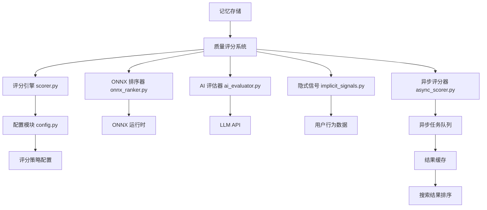

### 核心模块说明

| 模块 | 文件路径 | 功能描述 |
|------|----------|----------|
| 评分引擎 | `quality/scorer.py` | 核心评分逻辑，整合多维度评分因子 |
| ONNX 排序器 | `quality/onnx_ranker.py` | 使用 ONNX 加速的机器学习排序模型 |
| AI 评估器 | `quality/ai_evaluator.py` | 基于大语言模型的质量评估 |
| 异步评分器 | `quality/async_scorer.py` | 后台异步执行批量评分任务 |
| 配置模块 | `quality/config.py` | 评分策略和参数配置管理 |
| 隐式信号 | `quality/implicit_signals.py` | 从用户行为中提取质量信号 |
| ONNX 嵌入 | `embeddings/onnx_embeddings.py` | 语义嵌入向量生成 |

## 评分策略配置

质量评分系统通过 `config.py` 模块提供灵活的配置选项。配置参数控制评分算法的行为、权重分配和性能调优。

### 配置参数表

| 参数 | 类型 | 默认值 | 说明 |
|------|------|--------|------|
| `contentQuality` | float | 0.3 | 内容质量评估权重 |
| `relevanceWeight` | float | 0.4 | 语义相关性权重 |
| `recencyWeight` | float | 0.2 | 时间衰减因子权重 |
| `usageWeight` | float | 0.1 | 使用频率权重 |
| `minQualityThreshold` | float | 0.5 | 最低质量阈值 |

配置示例：

```python
from mcp_memory_service.quality.config import QualityConfig

config = QualityConfig(
    contentQuality=0.35,
    relevanceWeight=0.35,
    recencyWeight=0.15,
    usageWeight=0.15,
    minQualityThreshold=0.6
)
```

## ONNX 加速排序

系统使用 ONNX Runtime 加速机器学习排序模型的推理过程。相比纯 Python 实现，ONNX 排序器能够显著提升批量评分的吞吐量。

### ONNX 排序器工作流程

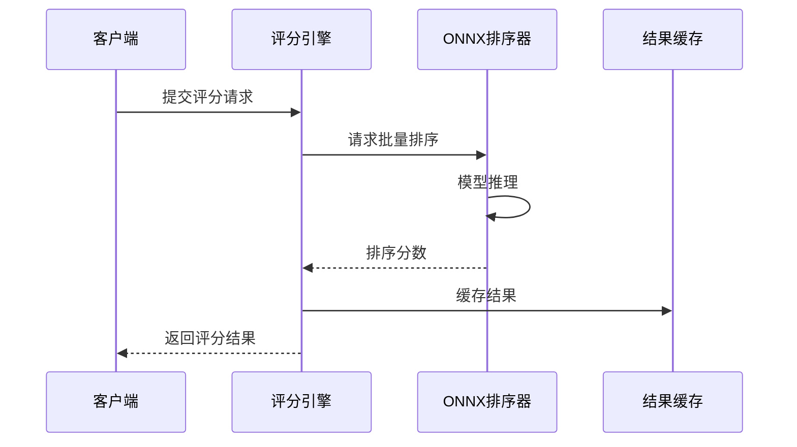

ONNX 嵌入模块负责将文本内容转换为高维向量表示，用于后续的语义相似度计算和质量评估。嵌入向量结合了语义信息和上下文关系，为评分引擎提供丰富的特征输入。

## 异步评分机制

对于批量评分任务，系统采用异步处理架构以避免阻塞主线程。异步评分器支持任务队列管理、并发控制和结果回调。

### 异步评分特性

异步评分器提供以下核心功能：

1. **任务批量处理**：将多个评分请求合并为单一批处理任务，减少模型调用开销
2. **优先级队列**：支持按优先级排序的评分任务调度
3. **结果回调**：评分完成后自动触发预设的回调函数
4. **错误重试**：网络或服务异常时自动重试失败任务

```python
from mcp_memory_service.quality.async_scorer import AsyncScorer

async_scorer = AsyncScorer(max_concurrent=4)

# 提交异步评分任务
task_id = await async_scorer.submit_batch(
    memory_ids=["hash1", "hash2", "hash3"],
    callback=on_score_complete
)
```

## 隐式信号分析

隐式信号分析器从用户行为数据中提取质量相关的反馈信号，无需显式评分即可评估记忆的价值。

### 信号类型表

| 信号类型 | 数据来源 | 权重 | 说明 |
|----------|----------|------|------|
| 检索频率 | 搜索日志 | 0.25 | 记忆被检索的次数 |
| 引用次数 | 对话记录 | 0.30 | 记忆中内容被引用的次数 |
| 停留时长 | 会话数据 | 0.20 | 用户查看记忆的平均时长 |
| 修改频率 | 版本历史 | 0.15 | 记忆被修改的频率 |
| 关联强度 | 链接关系 | 0.10 | 与其他高价值记忆的关联数 |

隐式信号分析器持续监控用户与记忆的交互模式，通过机器学习算法识别高价值内容。系统会根据累积的信号数据动态调整评分模型的参数。

## AI 评估器

AI 评估器利用大语言模型的能力对记忆内容进行深度质量分析。该模块能够理解语义上下文，评估内容的完整性、清晰度和实用价值。

### 评估维度

| 维度 | 描述 | 分数范围 |
|------|------|----------|
| 内容完整性 | 记忆是否包含足够的上下文信息 | 0-1 |
| 语义清晰度 | 表述是否清晰、无歧义 | 0-1 |
| 实用价值 | 对未来参考的潜在价值 | 0-1 |
| 时效性 | 内容是否需要更新 | 0-1 |
| 唯一性 | 与现有记忆的重复程度 | 0-1 |

AI 评估器支持流式输出模式，能够在评估过程中逐步返回中间结果，便于实时显示评估进度。

## 关联质量提升

质量评分系统与关联记忆机制紧密集成。通过分析记忆之间的语义关联，系统能够识别和提升高价值内容的显示优先级。

关联质量提升特性包括：

- **语义聚类**：将相关内容自动分组
- **关联强度评分**：计算记忆间的关联紧密度
- **质量传播**：高评分记忆的关联项获得适度加分
- **去重推荐**：避免重复或高度相似的内容重复出现

该机制确保搜索结果不仅在语义上相关，而且在质量和独特性上也能满足用户需求。系统在处理关联查询时会综合考虑直接匹配度和关联记忆的质量表现。

## 集成指南

### 基础集成

在应用中使用质量评分系统：

```python
from mcp_memory_service.quality.scorer import QualityScorer
from mcp_memory_service.quality.config import QualityConfig

# 初始化配置和评分器
config = QualityConfig()
scorer = QualityScorer(config)

# 对单条记忆评分
memory_id = "abc12345"
score = await scorer.score_memory(memory_id)
print(f"记忆质量分数: {score.overall:.2f}")
```

### 批量评分集成

```python
from mcp_memory_service.quality.async_scorer import AsyncScorer

async_scorer = AsyncScorer(max_concurrent=10)

# 定义回调函数
def on_complete(task_id, results):
    print(f"任务 {task_id} 完成，共评分 {len(results)} 条记忆")

# 提交批量任务
results = await async_scorer.submit_batch(
    memory_ids=[...],  # 记忆 ID 列表
    callback=on_complete
)
```

## 配置示例

### 详细模式配置

```python
config = QualityConfig(
    contentQuality=0.4,
    relevanceWeight=0.3,
    recencyWeight=0.15,
    usageWeight=0.15,
    minQualityThreshold=0.5,
    enable_ai_evaluator=True,
    enable_implicit_signals=True,
    async_batch_size=50
)
```

### 简洁模式配置

```python
config = QualityConfig(
    contentQuality=0.2,
    relevanceWeight=0.5,
    recencyWeight=0.2,
    usageWeight=0.1,
    minQualityThreshold=0.6,
    enable_ai_evaluator=False,
    enable_implicit_signals=True,
    async_batch_size=20
)
```

## 性能指标

根据实际部署测试，系统在标准配置下的性能表现如下：

| 指标 | 数值 | 说明 |
|------|------|------|
| 单条评分延迟 | <50ms | 同步评分响应时间 |
| 批量评分吞吐 | ~100条/秒 | 异步模式下的处理速度 |
| ONNX 推理延迟 | <10ms | 单次模型推理时间 |
| 内存占用 | <100MB | 运行时内存峰值 |

性能数据来源于项目的基准测试套件，实际表现会因硬件配置和数据规模而有所不同。

## 相关文档

- [记忆质量指南](docs/guides/memory-quality-guide.md) - 详细的使用指南和最佳实践
- [关联质量提升](docs/features/association-quality-boost.md) - 关联机制的技术说明
- [API 参考](../api/reference.md) - 评分系统的 API 接口文档

---

<a id='mcp-integration'></a>

## MCP 协议集成

### 相关页面

相关主题：[代理框架集成](#agent-frameworks)

<details>
<summary>相关源码文件</summary>

以下源码文件用于生成本页说明：

- [src/mcp_memory_service/mcp_server.py](https://github.com/doobidoo/mcp-memory-service/blob/main/src/mcp_memory_service/mcp_server.py)
- [src/mcp_memory_service/server/handlers/__init__.py](https://github.com/doobidoo/mcp-memory-service/blob/main/src/mcp_memory_service/server/handlers/__init__.py)
- [src/mcp_memory_service/server/handlers/memory.py](https://github.com/doobidoo/mcp-memory-service/blob/main/src/mcp_memory_service/server/handlers/memory.py)
- [src/mcp_memory_service/server/handlers/utility.py](https://github.com/doobidoo/mcp-memory-service/blob/main/src/mcp_memory_service/server/handlers/utility.py)
- [src/mcp_memory_service/discovery/mdns_service.py](https://github.com/doobidoo/mcp-memory-service/blob/main/src/mcp_memory_service/discovery/mdns_service.py)
- [docs/remote-mcp-setup.md](https://github.com/doobidoo/mcp-memory-service/blob/main/docs/remote-mcp-setup.md)
- [docs/guides/mcp-enhancements.md](https://github.com/doobidoo/mcp-memory-service/blob/main/docs/guides/mcp-enhancements.md)
</details>

# MCP 协议集成

MCP Memory Service 是一个基于 Model Context Protocol (MCP) 的语义记忆服务，为 Claude Code 等 MCP 客户端提供记忆存储、检索和语义搜索能力。本页面详细介绍 MCP 协议集成的架构设计、核心组件、API 接口以及配置方法。

## MCP 协议概述

Model Context Protocol (MCP) 是一种标准化协议，用于在 AI 助手与外部数据源、工具之间建立通信桥梁。MCP Memory Service 通过该协议暴露记忆管理功能，使 AI 助手能够：

- 持久化存储对话上下文和重要信息
- 基于语义相似性检索记忆
- 通过标签和类型组织记忆
- 实时获取记忆更新事件

资料来源：[src/mcp_memory_service/mcp_server.py](https://github.com/doobidoo/mcp-memory-service/blob/main/src/mcp_memory_service/mcp_server.py)

## 架构设计

### 整体架构图

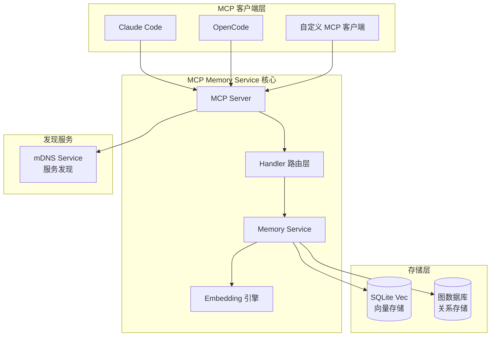

### 核心组件职责

| 组件 | 文件路径 | 主要职责 |
|------|----------|----------|
| MCP Server | `mcp_server.py` | 协议握手、请求路由、响应格式化 |
| Memory Handler | `handlers/memory.py` | 处理记忆 CRUD 操作 |
| Utility Handler | `handlers/utility.py` | 处理健康检查、统计等辅助功能 |
| Memory Service | `services/memory_service.py` | 业务逻辑编排、数据验证 |
| mDNS Service | `discovery/mdns_service.py` | 局域网服务自动发现 |

资料来源：[src/mcp_memory_service/server/handlers/__init__.py](https://github.com/doobidoo/mcp-memory-service/blob/main/src/mcp_memory_service/server/handlers/__init__.py)

## Handler 路由层设计

### 路由分发流程

```mermaid
sequenceDiagram
    participant Client as MCP 客户端
    participant Server as MCP Server
    participant Router as Handler Router
    participant Handler as 具体 Handler
    
    Client->>Server: MCP JSON-RPC 请求
    Server->>Router: 解析 method 名称
    Router->>Handler: 路由到对应 Handler
    Handler->>Handler: 执行业务逻辑
    Handler->>Router: 返回处理结果
    Router->>Server: 封装响应
    Server->>Client: 返回 JSON-RPC 响应
```

### Handler 模块结构

```python
# handlers/__init__.py 导出结构
from .memory import MemoryHandler    # 记忆操作处理器
from .utility import UtilityHandler   # 工具类处理器
```

每个 Handler 负责特定的 MCP 工具调用，遵循统一的接口规范：

| 方法 | 说明 |
|------|------|
| `initialize()` | 初始化处理器，验证配置 |
| `handle_request()` | 处理传入的 MCP 请求 |
| `get_schema()` | 返回工具的 JSON Schema 定义 |

资料来源：[src/mcp_memory_service/server/handlers/__init__.py](https://github.com/doobidoo/mcp-memory-service/blob/main/src/mcp_memory_service/server/handlers/__init__.py)

## Memory Handler 详解

Memory Handler 是 MCP 协议集成的核心，负责处理所有与记忆相关的操作。

资料来源：[src/mcp_memory_service/server/handlers/memory.py](https://github.com/doobidoo/mcp-memory-service/blob/main/src/mcp_memory_service/server/handlers/memory.py)

### 支持的工具调用

| 工具名称 | 方法 | 功能描述 |
|----------|------|----------|
| `store_memory` | 存储记忆 | 创建新记忆，自动生成嵌入向量 |
| `retrieve_memory` | 检索记忆 | 通过哈希值获取单条记忆 |
| `search_memories` | 语义搜索 | 基于向量相似度搜索相关记忆 |
| `list_memories` | 列表查询 | 分页获取记忆列表 |
| `delete_memory` | 删除记忆 | 移除指定记忆及其关联数据 |
| `update_memory` | 更新记忆 | 修改记忆内容和元数据 |

### 请求参数模型

```mermaid
graph LR
    A[store_memory] --> B{content}
    A --> C{tags?}
    A --> D{memory_type?}
    A --> E{metadata?}
    
    F[search_memories] --> G{query}
    F --> H{limit?}
    F --> I{similarity_threshold?}
    F --> J{tags_filter?}
```

| 参数名 | 类型 | 必填 | 说明 |
|--------|------|------|------|
| `content` | string | 是 | 记忆内容文本 |
| `tags` | string[] | 否 | 标签数组 |
| `memory_type` | string | 否 | 记忆类型（note/reference/session 等） |
| `metadata` | object | 否 | 自定义元数据 |
| `query` | string | 是（搜索时） | 搜索查询文本 |
| `limit` | integer | 否 | 返回结果数量限制 |
| `similarity_threshold` | float | 否 | 相似度阈值（0-1） |

### 响应格式

```json
{
  "content": [
    {
      "type": "text",
      "text": "Memory content here..."
    }
  ],
  "isError": false
}
```

错误响应示例：

```json
{
  "content": [
    {
      "type": "text", 
      "text": "Error: Memory not found"
    }
  ],
  "isError": true
}
```

## Utility Handler 详解

Utility Handler 提供系统级的辅助功能接口。

资料来源：[src/mcp_memory_service/server/handlers/utility.py](https://github.com/doobidoo/mcp-memory-service/blob/main/src/mcp_memory_service/server/handlers/utility.py)

### 健康检查接口

| 工具名称 | 功能 | 返回信息 |
|----------|------|----------|
| `health` | 服务健康状态 | 后端类型、记忆总数、运行时间 |
| `list_tools` | 列出可用工具 | 所有注册的 MCP 工具清单 |
| `get_capabilities` | 获取能力列表 | 服务器支持的协议特性 |

### 健康检查响应示例

```json
{
  "status": "healthy",
  "backend": "sqlite_vec",
  "memory_count": 1247,
  "version": "9.3.0",
  "uptime_seconds": 3600
}
```

## 服务发现机制

MCP Memory Service 支持通过 mDNS (Multicast DNS) 进行局域网服务自动发现，使客户端能够无需手动配置即可找到服务。

资料来源：[src/mcp_memory_service/discovery/mdns_service.py](https://github.com/doobidoo/mcp-memory-service/blob/main/src/mcp_memory_service/discovery/mdns_service.py)

### 服务公告流程

```mermaid
graph LR
    A[服务启动] --> B[注册 mDNS]
    B --> C[公告 _mcp-memory._tcp]
    C --> D[客户端发现服务]
    D --> E[获取 host:port]
    E --> F[建立 MCP 连接]
```

### 服务配置参数

| 参数 | 环境变量 | 默认值 | 说明 |
|------|----------|--------|------|
| 服务名称 | `MDNS_SERVICE_NAME` | `mcp-memory` | mDNS 服务标识 |
| 服务类型 | - | `_mcp-memory._tcp` | mDNS 服务协议类型 |
| 公告端口 | `PORT` | `8443` | MCP 服务监听端口 |
| API Key | `MCP_API_KEY` | 无 | 认证密钥 |

## MCP 工具调用示例

### Python SDK 使用方式

```python
from mcp_memory_service.api import search, store, health

# 健康检查（约 5 tokens）
>>> info = health()
>>> print(f"Backend: {info.backend}, Count: {info.count}")
Backend: sqlite_vec, Count: 1247

# 存储记忆（约 15 tokens）
>>> hash = store("New memory content", tags=["note", "important"])
>>> print(f"Stored: {hash}")
Stored: abc12345

# 语义搜索（约 20 tokens）
>>> results = search("architecture decisions", limit=5)
>>> for m in results.memories:
...     print(f"{m.hash}: {m.preview[:50]}...")
abc12345: Implemented OAuth 2.1 authentication for...
def67890: Refactored storage backend to support...
```

资料来源：[src/mcp_memory_service/api/__init__.py](https://github.com/doobidoo/mcp-memory-service/blob/main/src/mcp_memory_service/api/__init__.py)

### Claude Code 命令行调用

| 命令 | 功能 | 示例 |
|------|------|------|
| `/memory-recall` | 基于时间检索 | `/memory-recall "last week discussions"` |
| `/memory-search` | 标签/内容搜索 | `/memory-search --tags "architecture"` |
| `/memory-context` | 上下文捕获 | `/memory-context --summary "planning"` |
| `/memory-health` | 健康检查 | `/memory-health --detailed` |

资料来源：[claude_commands/README.md](https://github.com/doobidoo/mcp-memory-service/blob/main/claude_commands/README.md)

## 远程 MCP 配置

对于需要远程连接 MCP Memory Service 的场景，需要进行专门的配置。

资料来源：[docs/remote-mcp-setup.md](https://github.com/doobidoo/mcp-memory-service/blob/main/docs/remote-mcp-setup.md)

### 远程配置架构

```mermaid
graph LR
    subgraph "远程服务器"
        Server[MCP Memory Service]
        DB[(SQLite Vec)]
        Server --> DB
    end
    
    subgraph "本地客户端"
        Claude[Claude Code]
        Config[MCP Config]
    end
    
    Config -->|HTTPS + API Key| Server
```

### 配置步骤

1. **服务端配置**：确保服务监听在可访问的网络接口
2. **API Key 设置**：配置 `MCP_API_KEY` 环境变量
3. **客户端配置**：在 `~/.claude/settings.json` 中添加远程服务器信息

```json
{
  "mcpServers": {
    "memory": {
      "command": "npx",
      "args": ["-y", "@modelcontextprotocol/server-memory"],
      "url": "https://your-server:8443/mcp"
    }
  }
}
```

## MCP 增强功能

MCP Memory Service 在标准 MCP 协议基础上实现了多项增强功能。

资料来源：[docs/guides/mcp-enhancements.md](https://github.com/doobidoo/mcp-memory-service/blob/main/docs/guides/mcp-enhancements.md)

### 功能增强列表

| 增强功能 | 说明 | 启用方式 |
|----------|------|----------|
| 实时事件推送 | 支持 Server-Sent Events 实时推送记忆更新 | `/api/events` 端点 |
| 图关系推理 | 自动推断记忆间的语义关系 | `RelationshipInferenceEngine` |
| 类型本体优化 | 标准化记忆类型分类体系 | `improve_memory_ontology.py` |
| 响应大小限制 | 防止上下文窗口溢出 | `MCP_MAX_RESPONSE_CHARS` 环境变量 |

### 响应大小限制配置

```python
# src/mcp_memory_service/server/utils/response_limiter.py
import os

# 默认值：0 = 无限制（向后兼容）
DEFAULT_MAX_CHARS = int(os.environ.get("MCP_MAX_RESPONSE_CHARS", 0))
```

配置方式：

```bash
# 限制单次响应最大 100,000 字符
export MCP_MAX_RESPONSE_CHARS=100000
```

## 性能特性

| 指标 | 数值 | 说明 |
|------|------|------|
| Token 成本 | $0.15/1M tokens | 每 10 用户部署约 $16.43/年 |
| 首次调用延迟 | ~50ms | 包含存储初始化 |
| 后续调用延迟 | ~5-10ms | 连接复用 |
| 内存占用 | <10MB | 服务进程开销 |
| 搜索吞吐量 | ~1000 memories/second | 语义搜索 |

资料来源：[src/mcp_memory_service/api/__init__.py](https://github.com/doobidoo/mcp-memory-service/blob/main/src/mcp_memory_service/api/__init__.py)

## 与 Claude Code 的集成

Claude Code 通过 MCP 协议与 Memory Service 深度集成，支持自动化的记忆感知功能。

```mermaid
graph TB
    subgraph "Claude Code 生命周期"
        Start[Session Start]
        Compact[Compacting]
        End[Session End]
    end
    
    Start --> |自动加载| LoadMem[Load Relevant Memories]
    Compact --> |可选注入| InjectMem[Inject Context]
    End --> |自动保存| SaveMem[Save Session Insights]
    
    LoadMem --> MCPServer[MCP Server]
    MCPServer --> MemService[Memory Service]
```

### 钩子脚本列表

| 脚本 | 功能 | 版本 |
|------|------|------|
| `session-start.js` | 会话启动时加载记忆 | v2.2 |
| `session-end.js` | 会话结束时保存洞察 | v2.0 |
| `memory-retrieval.js` | 按需检索记忆 | v1.5 |
| `permission-request.js` | 权限自动化处理 | v1.0 |

资料来源：[claude-hooks/README.md](https://github.com/doobidoo/mcp-memory-service/blob/main/claude-hooks/README.md)

## 错误处理与调试

### 常见错误码

| 错误码 | 含义 | 处理建议 |
|--------|------|----------|
| `E_NOT_FOUND` | 记忆不存在 | 检查 content_hash 是否正确 |
| `E_DUPLICATE` | 记忆已存在 | 使用现有记忆或修改内容 |
| `E_INVALID_TAGS` | 标签格式错误 | 确保标签为字符串数组 |
| `E_CONNECTION_FAILED` | 连接失败 | 检查服务是否运行、网络是否通 |

### 调试模式启用

```bash
# CLI 启用调试
memory server --debug

# Claude Code 调试钩子
claude --debug hooks
```

## 总结

MCP Memory Service 通过标准化的 MCP 协议，为 AI 助手提供了强大的语义记忆能力。其核心优势包括：

- **标准化接口**：遵循 MCP 协议规范，支持多种 MCP 客户端
- **语义搜索**：基于向量嵌入的相似度检索
- **实时事件**：通过 SSE 推送实现即时记忆同步
- **自动发现**：mDNS 支持简化服务配置
- **高效性能**：毫秒级响应速度，低资源占用

通过 MCP 协议集成，MCP Memory Service 能够无缝融入 Claude Code 等 AI 开发工具的工作流，为开发者提供持久化的上下文记忆能力。

---

<a id='agent-frameworks'></a>

## 代理框架集成

### 相关页面

相关主题：[MCP 协议集成](#mcp-integration), [快速开始](#quick-start)

<details>
<summary>相关源码文件</summary>

以下源码文件用于生成本页说明：

- [src/mcp_memory_service/api/client.py](https://github.com/doobidoo/mcp-memory-service/blob/main/src/mcp_memory_service/api/client.py)
- [src/mcp_memory_service/api/operations.py](https://github.com/doobidoo/mcp-memory-service/blob/main/src/mcp_memory_service/api/operations.py)
- [claude-hooks/README.md](https://github.com/doobidoo/mcp-memory-service/blob/main/claude-hooks/README.md)
- [claude-hooks/core/session-end-harvest.js](https://github.com/doobidoo/mcp-memory-service/blob/main/claude-hooks/core/session-end-harvest.js)
- [claude-hooks/core/auto-capture-hook.js](https://github.com/doobidoo/mcp-memory-service/blob/main/claude-hooks/core/auto-capture-hook.js)
- [docs/guides/AGENTS.md](https://github.com/doobidoo/mcp-memory-service/blob/main/docs/guides/AGENTS.md)
- [docs/agents/langgraph.md](https://github.com/doobidoo/mcp-memory-service/blob/main/docs/agents/langgraph.md)
- [docs/agents/crewai.md](https://github.com/doobidoo/mcp-memory-service/blob/main/docs/agents/crewai.md)
- [docs/agents/autogen.md](https://github.com/doobidoo/mcp-memory-service/blob/main/docs/agents/autogen.md)
</details>

# 代理框架集成

## 概述

MCP Memory Service 通过提供标准化的 API 接口和专门设计的客户端模块，实现与主流 AI 代理框架的无缝集成。这些集成使得代理（Agent）能够利用持久化记忆服务，实现跨会话的上下文感知和长期知识积累。代理框架集成是 MCP Memory Service 的核心能力之一，它将记忆服务从简单的存储层提升为智能代理的外部记忆系统。 资料来源：[docs/guides/AGENTS.md]()

## 集成架构

### 整体架构图

```mermaid
graph TB
    subgraph "代理框架层"
        LG[LangGraph]
        CR[CrewAI]
        AG[AutoGen]
        CUSTOM[自定义代理]
    end
    
    subgraph "MCP Memory Service API"
        API[REST API]
        SSE[Server-Sent Events]
        TOOLS[MCP Tools]
    end
    
    subgraph "客户端层"
        CLIENT[Python Client]
        HOOKS[Claude Hooks]
    end
    
    subgraph "存储后端"
        SQLiteVec[(SQLite-Vec)]
        Cloudflare[(Cloudflare D1)]
    end
    
    LG --> CLIENT
    CR --> CLIENT
    AG --> CLIENT
    CUSTOM --> API
    HOOKS --> API
    CLIENT --> API
    API --> SSE
    API --> TOOLS
    API --> SQLiteVec
    API --> Cloudflare
```

### 核心组件关系

| 组件 | 职责 | 文件位置 |
|------|------|----------|
| Python Client | 提供高级 API 封装 | `src/mcp_memory_service/api/client.py` |
| Operations | 定义具体操作方法 | `src/mcp_memory_service/api/operations.py` |
| Claude Hooks | 会话生命周期记忆管理 | `claude-hooks/core/` |
| REST API | HTTP 接口暴露 | FastAPI 自动生成 |

## Python 客户端集成

### 客户端初始化

MCP Memory Service 提供了专门的 Python 客户端，用于代理框架集成。客户端支持连接配置和认证管理。

```python
from mcp_memory_service.api import search, store, health

# 搜索记忆 (20 tokens)
results = search("architecture decisions", limit=5)
for m in results.memories:
    print(f"{m.hash}: {m.preview[:50]}...")

# 存储记忆 (15 tokens)
hash = store("New memory", tags=["note", "important"])
print(f"Stored: {hash}")

# 健康检查 (5 tokens)
info = health()
print(f"Backend: {info.backend}, Count: {info.count}")
```

资料来源：[src/mcp_memory_service/api/__init__.py]()

### 核心操作接口

| 方法 | 功能 | 典型延迟 |
|------|------|----------|
| `search()` | 语义相似性搜索 | 5-10ms |
| `store()` | 存储新记忆 | 50ms (首次) / 5-10ms (后续) |
| `health()` | 服务健康检查 | <1ms |
| `list_memories()` | 分页列举记忆 | 5-10ms |
| `get_memory()` | 通过哈希获取单条记忆 | <5ms |

### 性能指标

根据基准测试数据，在 10 用户部署场景下的成本和性能表现如下：

- **成本**: $0.15/1M tokens，每年约 $16.43
- **首次调用延迟**: 约 50ms（包含存储初始化）
- **后续调用延迟**: 5-10ms（连接复用）
- **内存开销**: <10MB

资料来源：[src/mcp_memory_service/api/__init__.py]()

## Claude Hooks 集成

### 钩子类型概述

Claude Hooks 提供了一种轻量级的代理记忆集成方式，支持会话生命周期的自动记忆管理。

```mermaid
graph LR
    A[会话开始] --> B[Session-Start Hook]
    B --> C[加载相关记忆]
    C --> D[代理执行任务]
    D --> E[会话结束]
    E --> F[Session-End Hook]
    F --> G[存储会话洞察]
    
    H[自动捕获] --> I[Auto-Capture Hook]
    I --> D
```

### 会话结束收割机制

`session-end-harvest.js` 负责在会话结束时自动提取和存储关键信息：

| 功能 | 描述 |
|------|------|
| 决策提取 | 识别并保存会话中的关键决策 |
| 洞察收集 | 收集有价值的见解和发现 |
| 上下文保存 | 保留重要的技术上下文 |

资料来源：[claude-hooks/core/session-end-harvest.js]()

### 自动捕获钩子

`auto-capture-hook.js` 提供了实时记忆捕获能力，无需用户显式操作即可记录重要信息：

```javascript
// 自动捕获配置示例
{
  "captureTriggers": ["#remember", "#important"],
  "excludePatterns": ["password", "api-key"],
  "maxContentLength": 10000
}
```

资料来源：[claude-hooks/core/auto-capture-hook.js]()

### 配置选项

| 选项 | 默认值 | 说明 |
|------|--------|------|
| `verbose` | `true` | 显示基本信息 |
| `showMemoryDetails` | `false` | 显示记忆评分详情 |
| `cleanMode` | `false` | 最小化输出 |
| `injectAfterCompacting` | `false` | 紧凑化后注入记忆 |
| `contentQuality` | - | 内容质量评分权重 |

资料来源：[claude-hooks/README.md]()

## LangGraph 集成

### 集成方式

MCP Memory Service 可以作为 LangGraph 代理的外部记忆存储，实现状态感知的长期记忆管理。

```python
from langgraph.prebuilt import create_react_agent
from mcp_memory_service.api import search, store

# 创建带记忆的代理
def memory_node(state):
    query = state.get("query", "")
    results = search(query, limit=3)
    return {"memories": results.memories}

agent = create_react_agent(
    model=llm,
    tools=[memory_node],
    state_modifier="你有一个外部记忆系统可以使用。"
)
```

### 状态流设计

```mermaid
graph TB
    START[用户输入] --> MEMORY_QUERY[查询记忆]
    MEMORY_QUERY --> MEMORY_RESULTS[返回相关记忆]
    MEMORY_RESULTS --> CONTEXT_BUILD[构建上下文]
    CONTEXT_BUILD --> LLM_REASON[LLM 推理]
    LLM_REASON --> DECISION{需要新记忆?}
    DECISION -->|是| STORE[存储记忆]
    DECISION -->|否| RESPONSE[返回响应]
    STORE --> RESPONSE
```

资料来源：[docs/agents/langgraph.md]()

## CrewAI 集成

### 代理角色配置

CrewAI 中的代理可以配置使用 MCP Memory Service 作为共享知识库：

```python
from crewai import Agent
from mcp_memory_service.api import search

researcher = Agent(
    role="研究员",
    goal="基于现有知识库进行深入研究",
    backstory="你是一个研究专家，可以访问公司的知识库。",
    tools=[search]
)
```

### 记忆感知工作流

| 组件 | 功能 |
|------|------|
| 共享记忆库 | 所有代理可访问的持久化记忆 |
| 上下文注入 | 自动将相关记忆注入代理上下文 |
| 学习反馈 | 任务完成后自动更新记忆库 |

资料来源：[docs/agents/crewai.md]()

## AutoGen 集成

### 会话管理器集成

AutoGen 的群组会话管理器可以与 MCP Memory Service 深度集成：

```python
import autogen
from mcp_memory_service.api import store, search

# 创建记忆感知的群组管理员
class MemoryGroupChat(autogen.GroupChat):
    def __init__(self, *args, **kwargs):
        super().__init__(*args, **kwargs)
        self.memory_service = True
    
    def select_speaker(self):
        # 基于相关记忆选择下一个发言者
        context = search(self.messages_summary)
        return super().select_speaker()
```

### 多代理记忆同步

```mermaid
graph TB
    subgraph "AutoGen 群组"
        AGENT1[代理 A]
        AGENT2[代理 B]
        AGENT3[代理 C]
    end
    
    subgraph "记忆服务"
        MEMSTORE[(记忆存储)]
    end
    
    AGENT1 -->|写入洞察| MEMSTORE
    AGENT2 -->|写入发现| MEMSTORE
    AGENT3 -->|写入结论| MEMSTORE
    AGENT1 -->|读取| MEMSTORE
    AGENT2 -->|读取| MEMSTORE
    AGENT3 -->|读取| MEMSTORE
```

资料来源：[docs/agents/autogen.md]()

## 配置管理

### 环境变量配置

| 变量 | 默认值 | 说明 |
|------|--------|------|
| `MCP_MAX_RESPONSE_CHARS` | `0` (无限制) | 最大响应字符数 |
| `MCP_MEMORY_ENDPOINT` | 本地服务 | API 端点地址 |
| `MCP_MEMORY_API_KEY` | 无 | API 认证密钥 |

### 客户端配置示例

```python
from mcp_memory_service.api.client import MemoryServiceClient

client = MemoryServiceClient(
    endpoint="https://your-server:8443",
    api_key="your-api-key",
    timeout=30,
    max_retries=3
)
```

资料来源：[src/mcp_memory_service/api/client.py]()

## 错误处理与容错

### 重试策略

Python 客户端内置自动重试机制：

| 错误类型 | 重试次数 | 退避策略 |
|----------|----------|----------|
| 网络超时 | 3 次 | 指数退避 |
| 500 错误 | 2 次 | 线性退避 |
| 认证失败 | 0 次 | 立即失败 |

### 降级处理

当记忆服务不可用时，代理框架可以配置降级策略：

1. **静默降级**: 继续执行任务，记录警告
2. **缓存降级**: 使用本地缓存的记忆
3. **失败降级**: 返回错误，要求用户干预

资料来源：[src/mcp_memory_service/api/operations.py]()

## 最佳实践

### 记忆质量控制

| 原则 | 说明 |
|------|------|
| 相关性过滤 | 仅存储与目标相关的信息 |
| 去重处理 | 避免存储重复内容 |
| 时效性管理 | 定期清理过时记忆 |
| 隐私保护 | 过滤敏感信息后再存储 |

### 性能优化建议

1. **批量操作**: 使用批量 API 减少网络往返
2. **连接复用**: 保持长连接以降低延迟
3. **异步处理**: 非关键路径使用异步调用
4. **缓存策略**: 实现本地缓存减少重复查询

### 安全注意事项

- API 密钥应存储在环境变量或密钥管理服务中
- 敏感记忆内容应在存储前进行脱敏处理
- 定期轮换 API 访问凭证

## 版本兼容性

| 功能 | 最低版本要求 |
|------|--------------|
| Python 客户端 | v5.0.0+ |
| Claude Hooks | v8.5.7+ |
| LangGraph 集成 | v6.0.0+ |
| CrewAI 集成 | v0.4.0+ |
| AutoGen 集成 | v0.2.0+ |

## 故障排查

### 常见问题

| 问题 | 可能原因 | 解决方案 |
|------|----------|----------|
| 连接超时 | 服务未启动 | 检查 `curl http://localhost:8000/api/health` |
| 认证失败 | API 密钥错误 | 验证环境变量配置 |
| 记忆未找到 | 哈希值错误 | 使用 `list_memories()` 检查 |
| 响应延迟高 | 网络问题或负载高 | 检查服务端资源使用情况 |

### 诊断命令

```bash
# 检查服务健康状态
curl http://localhost:8000/api/health

# 检查 SSE 连接统计
curl http://localhost:8000/api/events/stats

# 验证 Python 客户端连接
python -c "from mcp_memory_service.api import health; print(health())"

---

<a id='plugins'></a>

## 插件系统

### 相关页面

相关主题：[MCP 协议集成](#mcp-integration), [记忆整合系统](#consolidation)

<details>
<summary>相关源码文件</summary>

以下源码文件用于生成本页说明：

- [src/mcp_memory_service/plugins/__init__.py](https://github.com/doobidoo/mcp-memory-service/blob/main/src/mcp_memory_service/plugins/__init__.py)
- [src/mcp_memory_service/plugins/registry.py](https://github.com/doobidoo/mcp-memory-service/blob/main/src/mcp_memory_service/plugins/registry.py)
- [src/mcp_memory_service/plugins/context.py](https://github.com/doobidoo/mcp-memory-service/blob/main/src/mcp_memory_service/plugins/context.py)
- [examples/plugin-audit-log/mcp_memory_plugin_audit_log/__init__.py](https://github.com/doobidoo/mcp-memory-service/blob/main/examples/plugin-audit-log/mcp_memory_plugin_audit_log/__init__.py)
- [docs/plugins/README.md](https://github.com/doobidoo/mcp-memory-service/blob/main/docs/plugins/README.md)
</details>

# 插件系统

## 概述

MCP Memory Service 的插件系统是一个事件驱动的扩展框架，允许开发者通过订阅特定的钩子（Hook）来拦截和响应内存操作的生命周期事件。该系统采用基于 entry_points 的自动发现机制，插件无需修改核心代码即可扩展服务功能。

## 架构设计

### 核心组件

插件系统由以下核心组件构成：

| 组件 | 文件路径 | 职责 |
|------|----------|------|
| 插件注册表 | `plugins/registry.py` | 管理所有已加载的插件，提供插件的注册、发现和生命周期管理 |
| 插件上下文 | `plugins/context.py` | 提供插件与核心系统交互的 API，包括事件订阅和上下文信息访问 |
| 插件入口 | `plugins/__init__.py` | 定义插件接口规范和公共导出 |

### 事件驱动模型

插件系统基于发布-订阅模式实现，核心服务在特定操作发生时触发相应的事件钩子：

```mermaid
graph TD
    A[核心服务] -->|触发事件| B[事件总线]
    B --> C[插件A - on_store处理器]
    B --> D[插件B - on_store处理器]
    B --> E[插件C - on_retrieve处理器]
    
    C -->|处理| F[执行自定义逻辑]
    D -->|处理| G[记录审计日志]
    E -->|处理| H[缓存管理]
```

## 可用钩子

系统提供四个主要的事件钩子，覆盖内存数据的完整生命周期：

| 钩子名称 | 触发时机 | 典型用途 | 资料来源 |
|----------|----------|----------|----------|
| `on_store` | 新建记忆时 | 审计日志、自定义索引、统计收集 | [examples/plugin-audit-log/README.md]() |
| `on_delete` | 删除记忆时 | 清理关联资源、更新统计数据 | [examples/plugin-audit-log/README.md]() |
| `on_retrieve` | 查询记忆时 | 缓存记录、查询日志、性能监控 | [examples/plugin-audit-log/README.md]() |
| `on_consolidate` | 记忆类型合并时 | 记录合并操作、验证数据一致性 | [examples/plugin-audit-log/README.md]() |

## 开发指南

### 创建插件

#### 步骤一：创建插件包结构

```
my-memory-plugin/
├── my_memory_plugin/
│   └── __init__.py
├── pyproject.toml
└── README.md
```

#### 步骤二：配置 entry_points

在 `pyproject.toml` 中声明插件入口点：

```toml
[project]
name = "my-memory-plugin"
version = "0.1.0"

[project.entry-points."mcp_memory_service.plugins"]
my_plugin = "my_memory_plugin:register"
```

#### 步骤三：实现插件逻辑

```python
# my_memory_plugin/__init__.py

def register(ctx):
    """
    注册插件处理器
    
    参数:
        ctx: PluginContext 实例，提供事件订阅和系统交互能力
    """
    ctx.on("on_store", handle_store)
    ctx.on("on_delete", handle_delete)
    ctx.on("on_retrieve", handle_retrieve)
    ctx.on("on_consolidate", handle_consolidate)

def handle_store(event):
    """处理记忆存储事件"""
    print(f"新记忆已存储: {event.hash}")
    print(f"类型: {event.memory_type}, 标签: {event.tags}")

def handle_delete(event):
    """处理记忆删除事件"""
    print(f"记忆已删除: {event.hash}")

def handle_retrieve(event):
    """处理记忆检索事件"""
    print(f"查询: {event.query}, 返回结果: {event.count} 条")
    return event  # 返回事件对象，确保后续处理器正常执行

def handle_consolidate(event):
    """处理记忆类型合并事件"""
    print(f"合并操作: {event.old_type} -> {event.new_type}")
    print(f"影响记忆数: {event.affected_count}")
```

### 安装和使用

1. 以开发模式安装插件：

```bash
cd my-memory-plugin
pip install -e .
```

2. 重启 MCP Memory Service：

```bash
systemctl --user restart mcp-memory-http.service
```

3. 验证插件加载状态：

```bash
curl -k https://localhost:8443/api/health
```

## 插件示例：审计日志

`examples/plugin-audit-log` 提供了一个完整的参考实现：

```python
# 事件处理函数示例

def on_store_handler(event):
    """记录存储操作"""
    log_entry = {
        "action": "store",
        "hash": event.hash,
        "memory_type": event.memory_type,
        "tags": event.tags,
        "content_length": len(event.content)
    }
    audit_logger.info(log_entry)

def on_delete_handler(event):
    """记录删除操作"""
    log_entry = {
        "action": "delete",
        "hash": event.hash
    }
    audit_logger.info(log_entry)

def on_retrieve_handler(event):
    """记录检索操作"""
    log_entry = {
        "action": "retrieve",
        "query": event.query,
        "result_count": len(event.results)
    }
    audit_logger.info(log_entry)
    return event  # 返回事件确保后续处理链不被中断
```

## 插件上下文 API

`PluginContext` 对象提供以下核心能力：

| 方法 | 说明 | 返回值 |
|------|------|--------|
| `on(event, handler)` | 订阅指定事件 | 无 |
| `off(event, handler)` | 取消事件订阅 | 无 |
| `emit(event, data)` | 触发事件（由系统内部调用） | 无 |

## 最佳实践

### 事件处理器返回值

处理检索相关事件时，**必须返回原始事件对象**以确保事件链正常传递：

```python
def on_retrieve_handler(event):
    # 执行自定义逻辑
    process_results(event.results)
    # 必须返回事件对象
    return event
```

### 错误处理

插件应实现健壮的错误处理机制，避免因单点故障影响系统稳定性：

```python
def handle_store(event):
    try:
        # 插件逻辑
        do_something(event)
    except Exception as e:
        logger.error(f"插件处理失败: {e}")
        # 不抛出异常，保持系统正常运行
```

### 异步处理

对于耗时操作，建议使用异步机制：

```python
import asyncio

async def handle_store_async(event):
    await long_running_task(event)

def handle_store(event):
    asyncio.create_task(handle_store_async(event))
```

## 部署注意事项

| 项目 | 说明 |
|------|------|
| 安装位置 | 插件包需安装到与 MCP Memory Service 相同的环境 |
| 入口点名称 | 必须是 `mcp_memory_service.plugins` 组下的有效条目 |
| 服务重启 | 每次安装或更新插件后需重启服务 |
| 依赖隔离 | 建议使用虚拟环境管理插件依赖 |

---

---

## Doramagic 踩坑日志

项目：doobidoo/mcp-memory-service

摘要：发现 20 个潜在踩坑项，其中 0 个为 high/blocking；最高优先级：安装坑 - 来源证据：chore(milvus): track optional BaseStorage overrides + test coverage gaps。

## 1. 安装坑 · 来源证据：chore(milvus): track optional BaseStorage overrides + test coverage gaps

- 严重度：medium
- 证据强度：source_linked
- 发现：GitHub 社区证据显示该项目存在一个安装相关的待验证问题：chore(milvus): track optional BaseStorage overrides + test coverage gaps
- 对用户的影响：可能阻塞安装或首次运行。
- 建议检查：来源问题仍为 open，Pack Agent 需要复核是否仍影响当前版本。
- 防护动作：不得脱离来源链接放大为确定性结论；需要标注适用版本和复核状态。
- 证据：community_evidence:github | cevd_520e5021db184be199bf78f1b662b13c | https://github.com/doobidoo/mcp-memory-service/issues/888 | 来源讨论提到 docker 相关条件，需在安装/试用前复核。

## 2. 安装坑 · 来源证据：v10.51.0 — Plugin hooks live, dynamic /api/types, audit-log example

- 严重度：medium
- 证据强度：source_linked
- 发现：GitHub 社区证据显示该项目存在一个安装相关的待验证问题：v10.51.0 — Plugin hooks live, dynamic /api/types, audit-log example
- 对用户的影响：可能增加新用户试用和生产接入成本。
- 建议检查：来源显示可能已有修复、规避或版本变化，说明书中必须标注适用版本。
- 防护动作：不得脱离来源链接放大为确定性结论；需要标注适用版本和复核状态。
- 证据：community_evidence:github | cevd_fdb895dcb5694a15937c208c89c79c98 | https://github.com/doobidoo/mcp-memory-service/releases/tag/v10.51.0 | 来源类型 github_release 暴露的待验证使用条件。

## 3. 安装坑 · 来源证据：v10.51.1 — Milvus consolidation fix

- 严重度：medium
- 证据强度：source_linked
- 发现：GitHub 社区证据显示该项目存在一个安装相关的待验证问题：v10.51.1 — Milvus consolidation fix
- 对用户的影响：可能增加新用户试用和生产接入成本。
- 建议检查：来源显示可能已有修复、规避或版本变化，说明书中必须标注适用版本。
- 防护动作：不得脱离来源链接放大为确定性结论；需要标注适用版本和复核状态。
- 证据：community_evidence:github | cevd_c344fbad309a43aa81482c5e4b429a53 | https://github.com/doobidoo/mcp-memory-service/releases/tag/v10.51.1 | 来源类型 github_release 暴露的待验证使用条件。

## 4. 安装坑 · 来源证据：v10.51.3 — Versioned memory update flag + transitive graph inference

- 严重度：medium
- 证据强度：source_linked
- 发现：GitHub 社区证据显示该项目存在一个安装相关的待验证问题：v10.51.3 — Versioned memory update flag + transitive graph inference
- 对用户的影响：可能影响升级、迁移或版本选择。
- 建议检查：来源显示可能已有修复、规避或版本变化，说明书中必须标注适用版本。
- 防护动作：不得脱离来源链接放大为确定性结论；需要标注适用版本和复核状态。
- 证据：community_evidence:github | cevd_e282c4b45ed04c8eb58759d1b32722bc | https://github.com/doobidoo/mcp-memory-service/releases/tag/v10.51.3 | 来源讨论提到 python 相关条件，需在安装/试用前复核。

## 5. 安装坑 · 来源证据：v10.54.0 — AND/OR tag filtering for memory_search

- 严重度：medium
- 证据强度：source_linked
- 发现：GitHub 社区证据显示该项目存在一个安装相关的待验证问题：v10.54.0 — AND/OR tag filtering for memory_search
- 对用户的影响：可能影响升级、迁移或版本选择。
- 建议检查：来源显示可能已有修复、规避或版本变化，说明书中必须标注适用版本。
- 防护动作：不得脱离来源链接放大为确定性结论；需要标注适用版本和复核状态。
- 证据：community_evidence:github | cevd_5aa57485baf04502a8291b6694828c38 | https://github.com/doobidoo/mcp-memory-service/releases/tag/v10.54.0 | 来源讨论提到 python 相关条件，需在安装/试用前复核。

## 6. 安装坑 · 来源证据：v10.55.0 — Entity Extraction, Insight Cards, urllib3 bump

- 严重度：medium
- 证据强度：source_linked
- 发现：GitHub 社区证据显示该项目存在一个安装相关的待验证问题：v10.55.0 — Entity Extraction, Insight Cards, urllib3 bump
- 对用户的影响：可能增加新用户试用和生产接入成本。
- 建议检查：来源显示可能已有修复、规避或版本变化，说明书中必须标注适用版本。
- 防护动作：不得脱离来源链接放大为确定性结论；需要标注适用版本和复核状态。
- 证据：community_evidence:github | cevd_c50e5d07aa964a89a80ade8ee3055612 | https://github.com/doobidoo/mcp-memory-service/releases/tag/v10.55.0 | 来源类型 github_release 暴露的待验证使用条件。

## 7. 配置坑 · 可能修改宿主 AI 配置

- 严重度：medium
- 证据强度：source_linked
- 发现：项目面向 Claude/Cursor/Codex/Gemini/OpenCode 等宿主，或安装命令涉及用户配置目录。
- 对用户的影响：安装可能改变本机 AI 工具行为，用户需要知道写入位置和回滚方法。
- 建议检查：列出会写入的配置文件、目录和卸载/回滚步骤。
- 防护动作：涉及宿主配置目录时必须给回滚路径，不能只给安装命令。
- 证据：capability.host_targets | github_repo:908539519 | https://github.com/doobidoo/mcp-memory-service | host_targets=mcp_host, claude

## 8. 能力坑 · 能力判断依赖假设

- 严重度：medium
- 证据强度：source_linked
- 发现：README/documentation is current enough for a first validation pass.
- 对用户的影响：假设不成立时，用户拿不到承诺的能力。
- 建议检查：将假设转成下游验证清单。
- 防护动作：假设必须转成验证项；没有验证结果前不能写成事实。
- 证据：capability.assumptions | github_repo:908539519 | https://github.com/doobidoo/mcp-memory-service | README/documentation is current enough for a first validation pass.

## 9. 维护坑 · 来源证据：v10.55.1 — Entity Link Storage Fix

- 严重度：medium
- 证据强度：source_linked
- 发现：GitHub 社区证据显示该项目存在一个维护/版本相关的待验证问题：v10.55.1 — Entity Link Storage Fix
- 对用户的影响：可能增加新用户试用和生产接入成本。
- 建议检查：来源显示可能已有修复、规避或版本变化，说明书中必须标注适用版本。
- 防护动作：不得脱离来源链接放大为确定性结论；需要标注适用版本和复核状态。
- 证据：community_evidence:github | cevd_0d033317867f482985c4e395b8825cfe | https://github.com/doobidoo/mcp-memory-service/releases/tag/v10.55.1 | 来源类型 github_release 暴露的待验证使用条件。

## 10. 维护坑 · 维护活跃度未知

- 严重度：medium
- 证据强度：source_linked
- 发现：未记录 last_activity_observed。
- 对用户的影响：新项目、停更项目和活跃项目会被混在一起，推荐信任度下降。
- 建议检查：补 GitHub 最近 commit、release、issue/PR 响应信号。
- 防护动作：维护活跃度未知时，推荐强度不能标为高信任。
- 证据：evidence.maintainer_signals | github_repo:908539519 | https://github.com/doobidoo/mcp-memory-service | last_activity_observed missing

## 11. 安全/权限坑 · 下游验证发现风险项

- 严重度：medium
- 证据强度：source_linked
- 发现：no_demo
- 对用户的影响：下游已经要求复核，不能在页面中弱化。
- 建议检查：进入安全/权限治理复核队列。
- 防护动作：下游风险存在时必须保持 review/recommendation 降级。
- 证据：downstream_validation.risk_items | github_repo:908539519 | https://github.com/doobidoo/mcp-memory-service | no_demo; severity=medium

## 12. 安全/权限坑 · 存在安全注意事项

- 严重度：medium
- 证据强度：source_linked
- 发现：No sandbox install has been executed yet; downstream must verify before user use.
- 对用户的影响：用户安装前需要知道权限边界和敏感操作。
- 建议检查：转成明确权限清单和安全审查提示。
- 防护动作：安全注意事项必须面向用户前置展示。
- 证据：risks.safety_notes | github_repo:908539519 | https://github.com/doobidoo/mcp-memory-service | No sandbox install has been executed yet; downstream must verify before user use.

## 13. 安全/权限坑 · 存在评分风险

- 严重度：medium
- 证据强度：source_linked
- 发现：no_demo
- 对用户的影响：风险会影响是否适合普通用户安装。
- 建议检查：把风险写入边界卡，并确认是否需要人工复核。
- 防护动作：评分风险必须进入边界卡，不能只作为内部分数。
- 证据：risks.scoring_risks | github_repo:908539519 | https://github.com/doobidoo/mcp-memory-service | no_demo; severity=medium

## 14. 安全/权限坑 · 来源证据：feat: cascading search fallback when semantic results are sparse

- 严重度：medium
- 证据强度：source_linked
- 发现：GitHub 社区证据显示该项目存在一个安全/权限相关的待验证问题：feat: cascading search fallback when semantic results are sparse
- 对用户的影响：可能影响授权、密钥配置或安全边界。
- 建议检查：来源显示可能已有修复、规避或版本变化，说明书中必须标注适用版本。
- 防护动作：不得脱离来源链接放大为确定性结论；需要标注适用版本和复核状态。
- 证据：community_evidence:github | cevd_274fcdb5c1ed4290ac86171131d9db90 | https://github.com/doobidoo/mcp-memory-service/issues/873 | 来源类型 github_issue 暴露的待验证使用条件。

## 15. 安全/权限坑 · 来源证据：v10.50.0 — Plugin Hook Scaffolding

- 严重度：medium
- 证据强度：source_linked
- 发现：GitHub 社区证据显示该项目存在一个安全/权限相关的待验证问题：v10.50.0 — Plugin Hook Scaffolding
- 对用户的影响：可能影响升级、迁移或版本选择。
- 建议检查：来源显示可能已有修复、规避或版本变化，说明书中必须标注适用版本。
- 防护动作：不得脱离来源链接放大为确定性结论；需要标注适用版本和复核状态。
- 证据：community_evidence:github | cevd_af91db1e780a4ee5b0c16b8ea3238bf2 | https://github.com/doobidoo/mcp-memory-service/releases/tag/v10.50.0 | 来源讨论提到 python 相关条件，需在安装/试用前复核。

## 16. 安全/权限坑 · 来源证据：v10.51.2 — OAuth CORS fixes + Milvus embedding hydration

- 严重度：medium
- 证据强度：source_linked
- 发现：GitHub 社区证据显示该项目存在一个安全/权限相关的待验证问题：v10.51.2 — OAuth CORS fixes + Milvus embedding hydration
- 对用户的影响：可能影响授权、密钥配置或安全边界。
- 建议检查：来源显示可能已有修复、规避或版本变化，说明书中必须标注适用版本。
- 防护动作：不得脱离来源链接放大为确定性结论；需要标注适用版本和复核状态。
- 证据：community_evidence:github | cevd_d648b9854ac1432b8a86297ab220ba34 | https://github.com/doobidoo/mcp-memory-service/releases/tag/v10.51.2 | 来源类型 github_release 暴露的待验证使用条件。

## 17. 安全/权限坑 · 来源证据：v10.52.0 — Cascading Search Fallback + Embedding Hydration on Bulk Reads

- 严重度：medium
- 证据强度：source_linked
- 发现：GitHub 社区证据显示该项目存在一个安全/权限相关的待验证问题：v10.52.0 — Cascading Search Fallback + Embedding Hydration on Bulk Reads
- 对用户的影响：可能阻塞安装或首次运行。
- 建议检查：来源显示可能已有修复、规避或版本变化，说明书中必须标注适用版本。
- 防护动作：不得脱离来源链接放大为确定性结论；需要标注适用版本和复核状态。
- 证据：community_evidence:github | cevd_60ded0d65a2c417e9ce3c9ed7501cbad | https://github.com/doobidoo/mcp-memory-service/releases/tag/v10.52.0 | 来源类型 github_release 暴露的待验证使用条件。

## 18. 安全/权限坑 · 来源证据：v10.53.0 — Milvus Consolidation Embedding Hydration + GitPython Security

- 严重度：medium
- 证据强度：source_linked
- 发现：GitHub 社区证据显示该项目存在一个安全/权限相关的待验证问题：v10.53.0 — Milvus Consolidation Embedding Hydration + GitPython Security
- 对用户的影响：可能增加新用户试用和生产接入成本。
- 建议检查：来源显示可能已有修复、规避或版本变化，说明书中必须标注适用版本。
- 防护动作：不得脱离来源链接放大为确定性结论；需要标注适用版本和复核状态。
- 证据：community_evidence:github | cevd_42c0d95dd5b247d79790b6f92024a048 | https://github.com/doobidoo/mcp-memory-service/releases/tag/v10.53.0 | 来源讨论提到 python 相关条件，需在安装/试用前复核。

## 19. 维护坑 · issue/PR 响应质量未知

- 严重度：low
- 证据强度：source_linked
- 发现：issue_or_pr_quality=unknown。
- 对用户的影响：用户无法判断遇到问题后是否有人维护。
- 建议检查：抽样最近 issue/PR，判断是否长期无人处理。
- 防护动作：issue/PR 响应未知时，必须提示维护风险。
- 证据：evidence.maintainer_signals | github_repo:908539519 | https://github.com/doobidoo/mcp-memory-service | issue_or_pr_quality=unknown

## 20. 维护坑 · 发布节奏不明确

- 严重度：low
- 证据强度：source_linked
- 发现：release_recency=unknown。
- 对用户的影响：安装命令和文档可能落后于代码，用户踩坑概率升高。
- 建议检查：确认最近 release/tag 和 README 安装命令是否一致。
- 防护动作：发布节奏未知或过期时，安装说明必须标注可能漂移。
- 证据：evidence.maintainer_signals | github_repo:908539519 | https://github.com/doobidoo/mcp-memory-service | release_recency=unknown

<!-- canonical_name: doobidoo/mcp-memory-service; human_manual_source: deepwiki_human_wiki -->

